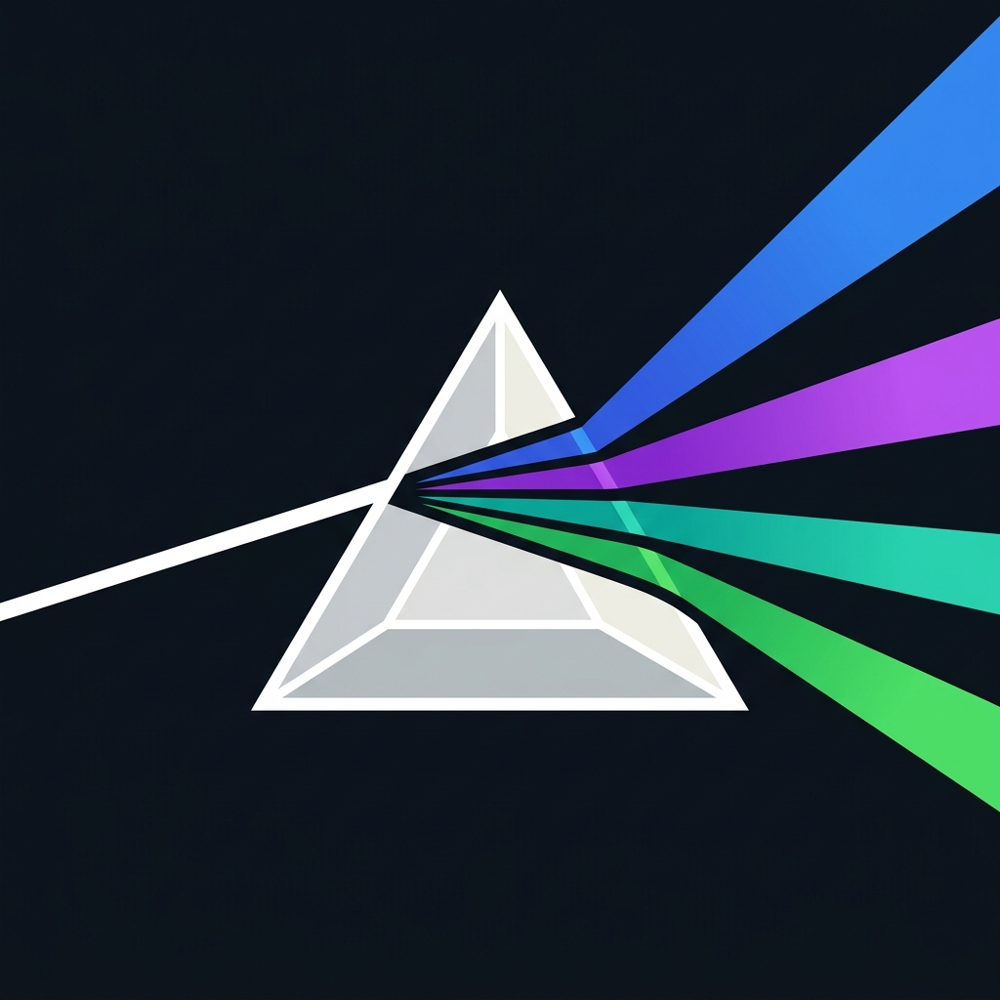

<p align="center">
  
</p>

<h1 align="center">Diverge</h1>
<p align="center"><em>Branch your infrastructure, not just your code.</em></p>

<p align="center">
  <a href="https://github.com/divergedev/diverge/actions/workflows/ci.yml"></a>
  <a href="https://github.com/divergedev/diverge/blob/main/LICENSE"></a>
  <a href="https://github.com/divergedev/diverge"></a>
</p>

Environment-as-a-service engine for Kubernetes. Diverge creates ephemeral preview environments triggered by merge request events, with delta deployment (only deploy changed services), configurable database provisioning, and Istio-based header routing.

Documentation: [https://divergedev.com](https://divergedev.com)

## Try It

> **[5-minute demo →](https://github.com/divergedev/demo)** — Multi-repo preview environments with k3d + Envoy Gateway. Features a complete hands-on bank-demo showcasing database schema isolation and automated migration jobs!

## Key Features
*   **PreviewGroup Orchestration**: Manage multiple child environments and services under a single CR tied directly to an MR/PR. Automatic orphan cleanup and label-based ownership.
*   **Scale-to-Zero**: Idle preview environments automatically scale to zero via KEDA HTTP Add-on (`HTTPScaledObject`). The interceptor wakes up pods on the first request, resulting in 90%+ resource savings for idle MRs.
*   **Activator Proxy**: Smart routing that directs traffic to the pod when ready. Includes `X-Preview-Env` header injection and a shared informer for efficient pod state tracking.
*   **Delta Deployment**: Only deploy what changed, falling back to a baseline for unmodified services.
*   **Header-Based Routing & Gateway API**: Leverages Gateway API, Istio, and the Diverge Proxy to route traffic seamlessly using HTTP headers.
*   **Configurable DB Modes**: Options for shared, schema, snapshot, or fresh databases for your environments.
*   **Schema-per-Environment**: Actual execution of SQL-based schema provisioning (via `SQLExecutor`), regex-validated naming, injection prevention, and automated migration Jobs.
*   **MR-Triggered Lifecycle**: Environments spin up when a Merge Request opens and tear down upon merge/close.
*   **Merge Gating**: GitLab/GitHub commit status checks (`diverge/preview`) block merges until environments are healthy.
*   **Argo CD & Direct Deploy**: Argo CD GitOps (`Application` CRs) and No-ArgoCD mode (`DirectDeployer`) for Helm charts and Kustomize overlays.
*   **Test Integration**: CI trigger and polling support to run automated tests against preview environments.
*   **Prometheus Metrics**: Exposes metrics for environment lifecycles and controller health monitoring.
*   **Namespace Labels**: Custom labels on preview namespaces (e.g., `istio.io/dataplane-mode: ambient` for zero-trust mTLS).
*   **Security Hardened**: Webhook secret constant-time comparison, RFC 7230 header validation, safe SHA handling, ArgoCD namespace bypass prevention, IPv6-safe pod URLs, typed Server-Side Apply (SSA), and strict label validation.
*   **Finalizer-Based Lifecycle**: Kubernetes finalizers ensure clean teardown of all resources (routing, database, ArgoCD apps) even during force-deletes.
*   **TTL Auto-Expiry**: Automatic environment cleanup after configurable TTL with requeue-based expiry.
*   **Multi-SCM Notifiers**: GitLab MR comments and GitHub PR comments with status updates.
*   **Proto Foundation**: Protobuf-defined domain types with ConnectRPC service definition for future API server.

## Security
Diverge takes security seriously. The platform features strict CRD OpenAPI validation, context timeouts on all external calls, and prevention mechanisms for shell/markdown injection in templates. The controller uses RBAC-scoped clients to ensure it only has the permissions it needs. Webhook interactions are secured using constant-time comparisons for secrets and RFC 7230-compliant header validation. Recent hardening includes ArgoCD namespace bypass prevention, safe SHA handling to eliminate panics, IPv6-safe pod URLs, comprehensive label validation, and Typed Server-Side Apply (SSA) to ensure safe resource updates.

## Architecture

Diverge consists of 4 main components compiled into a single consolidated Docker image (`ghcr.io/divergedev/diverge:latest`), released via `goreleaser`:

1.  **Controller (`diverge-controller`)**: The Kubernetes operator that watches for `PreviewGroup` and `Environment` Custom Resources (CRs), reconciles them, and provisions the necessary resources (like Argo CD `Application` CRs, databases, etc.).
2.  **Proxy (`diverge-proxy`)**: A reverse proxy that helps facilitate header-based routing to preview environments.
3.  **Activator (`diverge-activator`)**: A proxy for scale-to-zero workloads. Wakes up sleeping pods on the first request and seamlessly routes traffic once they are ready.
4.  **CLI (`diverge`)**: A powerful CLI to interact with Diverge environments directly from your terminal.

## PreviewGroup Example

A minimal `PreviewGroup` Custom Resource managing multiple services for a single MR:

```yaml
apiVersion: diverge.io/v1alpha1
kind: PreviewGroup
metadata:
  name: mr-42
spec:
  source:
    provider: gitlab
    project: myorg/platform
    branch: feat/payments
  routing:
    headerKey: x-preview-env
    headerValue: "42"
  services:
    - name: payments-api
      image: registry.example.com/payments:mr-42
      mode: image
      port: 8080
    - name: gateway
      mode: baseline
```

## CLI Commands

The `diverge` CLI helps you manage environments efficiently:
*   `diverge init` - Initialize a `.diverge.yaml` config
*   `diverge create` - Create a new environment
*   `diverge list` - List active environments
*   `diverge status` - Check the status of an environment
*   `diverge open` - Open the preview URL in your browser
*   `diverge logs` - Stream logs for a preview environment
*   `diverge validate` - Validate your `.diverge.yaml`
*   `diverge delete` - Delete an environment
*   `diverge version` - Show CLI version

## Installation

The easiest way to install Diverge is via Helm:

```bash
helm repo add diverge https://charts.divergedev.io
helm repo update
helm install diverge diverge/diverge --namespace diverge-system --create-namespace
```

## Development

Diverge requires Go 1.26+. The project uses Nix to manage development dependencies.

```bash
# Enter the Nix development shell
nix develop

# Apply CRDs and run locally
nix develop -c make install
nix develop -c make run
```

Currently, the project contains **147 tests** utilizing table-driven tests, `testify/assert`, and Property-Based Testing (PBT) using the Hegel framework (`hegel.dev/go/hegel`).

## Roadmap

- [x] **CI Actions Node 22 Bump** (#25) — Migrate GitHub Actions to Node 22 runtime
- [x] **Godoc Coverage** (#26) — Complete documentation for all exported functions
- [x] **GitLab/GitHub Commit Statuses** — Merge gating via `diverge/preview` commit status checks
- [x] **Schema-per-Environment** — SQL-based schema provisioning with SchemaProvider
- [x] **Namespace Labels** — Custom labels on preview namespaces (Istio Ambient mTLS)
- [x] **Proto Foundation** — Protobuf domain types + ConnectRPC service definition
- [ ] **WebSocket Support** (#6) — Full WebSocket proxying for real-time preview environments
- [ ] **Controller EnvTest + E2E** (#9) — Comprehensive controller integration tests with envtest
- [ ] **ConnectRPC API Server** (#12) — gRPC/ConnectRPC API server for environment management

## License
Apache 2.0
