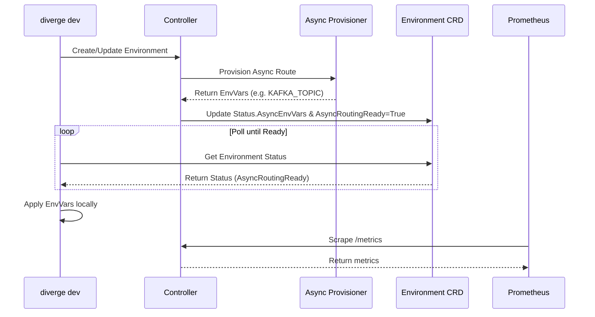

# Architecture

Diverge is built as a Kubernetes controller paired with a powerful CLI and SDK for developers.

## High-Level Architecture
1. **Controller**: The Diverge controller watches `Environment` CRDs and reconciles them.
2. **Provisioner**: Async routing resources are provisioned on-the-fly (e.g. Kafka topics, Temporal queues).
3. **Status**: The controller updates the `Environment` status, reporting `AsyncRoutingReady`.
4. **CLI**: The developer CLI interacts with the cluster, blocking on ready states and streaming logs.

## Async Routing Flow

## SDK Propagation
The `pkg/sdk` ensures that the preview environment context is propagated correctly across system boundaries:
- **HTTP/gRPC**: Headers are injected and extracted using the key `x-preview-env` (or overridden via `DIVERGE_HEADER_KEY`).
- **Kafka**: Context is injected into message headers using `kafka.InjectHeaders()`.
- **Temporal**: Workflows receive context via the `ContextPropagator` implemented for Temporal.

## Metrics Collection
The controller and server expose metrics on `:9090` (`/metrics`). Prometheus scrapes this endpoint and visualizes the telemetry (e.g. `diverge_server_rpc_requests_total`) in Grafana.
