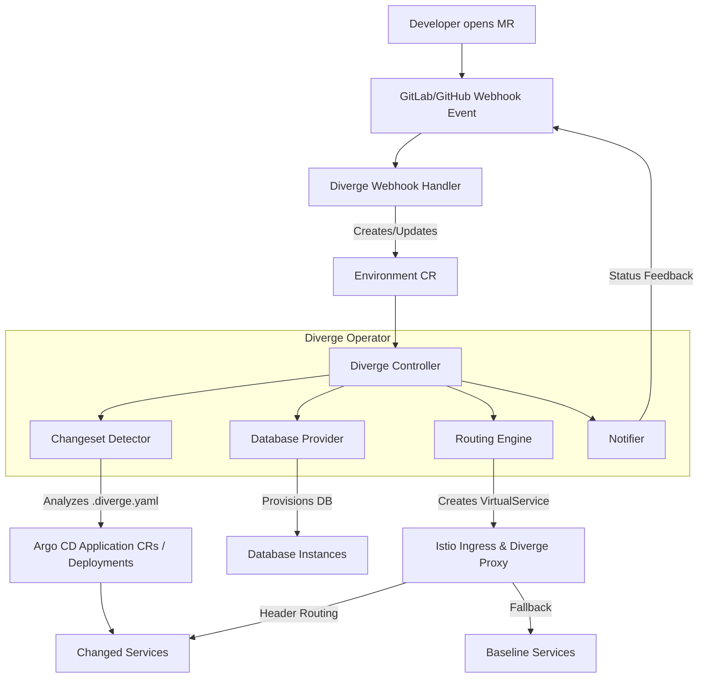

# Diverge Architecture

## Overview
Diverge is an open-source environment-as-a-service engine designed for Kubernetes. It solves the challenge of provisioning and maintaining ephemeral preview environments triggered by code changes, primarily from Merge Requests (MRs). By bridging version control events, infrastructure configuration, and routing intelligence, Diverge allows engineering teams to branch their infrastructure the same way they branch their code.

Instead of deploying full duplicates of complex microservice architectures, Diverge supports delta deployments—only deploying the services that have changed while reusing the unchanged baseline environment.

## System Architecture

## Components

- **Controller**: The Kubernetes controller (reconciler) that watches `Environment` Custom Resources (CRs). It orchestrates the entire deployment lifecycle, executing state transitions.
- **Proxy**: A reverse proxy that assists with header-based routing, seamlessly directing traffic to the correct preview environment.
- **CLI**: A command-line tool (`diverge`) allowing developers to interact with and manage preview environments directly from their terminal.
- **Webhook Handler**: An HTTP server that listens to GitLab/GitHub webhook events (e.g., MR open, update, merge, close). It translates these events into Kubernetes `Environment` CRs, applying labels for configuration overrides based on MR details.
- **Changeset Detector**: Responsible for identifying which services have been modified in the current branch by performing a git diff and mapping the changed files to service paths defined in `.diverge.yaml`.
- **Database Providers**: Pluggable interfaces to handle database provisioning dynamically according to the requested mode (e.g., creating schemas, restoring from snapshots, or providing fresh databases).
- **Routing Engine**: Configures the underlying service mesh (e.g., Istio) to route traffic appropriately. In header-based mode, it generates Istio `VirtualService` and `DestinationRule` resources.
- **ArgoCD Deployer**: Generates and manages Argo CD `Application` CRs, supporting both Helm and Kustomize source types.
- **Notifier**: (Optional) Sends status updates back to the Version Control System (like GitLab/GitHub MR/PR comments) regarding deployment progress and preview URLs.
- **API Server** (Coming soon - Issue #12): A forthcoming gRPC/ConnectRPC API server for extended environment management and integration.

## CRD Design

The core of Diverge is the `Environment` Custom Resource Definition (CRD).

### Spec
The `EnvironmentSpec` dictates the desired state:
- `Source`: Provider (e.g., gitlab), Project name, MR ID, and Branch.
- `Deploy`: Deployment mode (`delta` or `full`), list of changed services, and a baseline reference.
- `Routing`: Routing mode, header key/value pair, and external URL.
- `Database`: DB mode (`shared`, `schema`, `snapshot`, `fresh`), connection string, and migration commands.
- `Lifecycle`: Time-to-Live (TTL) and cleanup behaviors.

### Status & State Machine
The `EnvironmentStatus` tracks the observed state. Environments use the `diverge.io/finalizer` to ensure a clean teardown of external resources during deletion. The lifecycle of an environment moves through specific phases:
- `Pending`: The environment resource has been created but no action has taken place.
- `Deploying`: The controller is currently provisioning databases, deploying services, and configuring routing rules.
- `Running`: The environment is healthy and actively serving traffic.
- `Failed`: An error occurred during the provisioning or deployment phase.
- `Terminating`: The environment is being dismantled (e.g., after an MR is closed/merged or TTL expiry).

Phase transitions are driven by standard Kubernetes `metav1.Condition` types that track sub-system readiness, specifically: `NamespaceReady`, `DatabaseReady`, `RoutingReady`, and `ServicesReady`.

## Delta Deployment

Diverge employs a Delta Deployment strategy to optimize resources.
When a change occurs, the Changeset Detector performs a `git diff` against the target branch. It compares modified file paths against a configured service path map located in the repository's `.diverge.yaml` file.
Only the modified services are deployed to the Kubernetes cluster. Unmodified services fall back to a baseline environment (e.g., staging). This is powered heavily by the Routing Engine.

## Routing Modes

Diverge supports multiple routing strategies depending on cluster configuration:

- **Header-based (Istio VirtualService)**: The default and most efficient mode. It creates an Istio `VirtualService` that inspects incoming HTTP requests. If the request contains a specific header (e.g., `x-diverge-env: mr-123`), it routes traffic to the delta-deployed services. Otherwise, it falls back to the baseline environment.
- **Namespace isolation**: Deploys the entire environment into a dedicated, isolated Kubernetes namespace.
- **Subdomain**: Exposes the environment via a unique subdomain (e.g., `mr-123.preview.example.com`).

## Database Modes

Database handling is critical for isolated testing. Diverge offers several modes:

- **Shared**: The preview environment connects to the baseline database. Useful for read-only changes or non-destructive migrations.
- **Schema-per-env**: Creates a logical, isolated schema within an existing shared database cluster. A good balance of isolation and speed.
- **Snapshot**: Provisions a new database cloned from a recent production or staging snapshot. Ideal for realistic testing.
- **Fresh**: Provisions an entirely new, empty database instance and optionally runs seed scripts.

## Lifecycle Management

Diverge prevents cluster bloat through automated lifecycle management:

- **Cleanup on merge/close**: When an MR is merged or closed, the webhook handler signals the controller to change the CR phase to `Terminating`, triggering teardown.
- **TTL**: Environments can have a configured Time-To-Live (e.g., 7 days) to ensure stale environments are automatically garbage-collected.
- **Garbage Collection**: Reaps orphaned resources that no longer have a corresponding active MR.

## Integration Points

Diverge seamlessly integrates into the modern cloud-native stack:
- **VCS**: GitLab and GitHub webhooks drive the automation.
- **CD**: Often pairs with Argo CD (e.g., via direct `Application` CRs) to apply manifests.
- **Mesh**: Istio provides the underlying header-based routing fabric.
- **Infrastructure**: Crossplane can be utilized by the Database Providers to dynamically provision cloud-managed databases (like RDS or Cloud SQL).

## Security Architecture

Diverge incorporates secure-by-default design principles:
- **Webhook Security**: Employs constant-time token validation to prevent timing attacks.
- **Input Validation**: Enforces strict YAML parsing (disallowing unknown fields) and validates `HeaderKey` values against RFC 7230 token format constraints.
- **Path Traversal Prevention**: Ensures GitHub/GitLab notifier providers are safeguarded against path traversal vulnerabilities.
- **Resource Constraints**: Applies context timeouts on all external network and API calls to prevent hanging routines.
- **Least Privilege**: The controller runs with strictly RBAC-scoped permissions, acquiring only the access necessary for its operational scope.

## Observability

The controller provides rich observability by emitting standard Kubernetes events (`Normal` and `Warning`) during all key lifecycle transitions, failures, and teardowns, ensuring tight integration with existing cluster monitoring tools.
