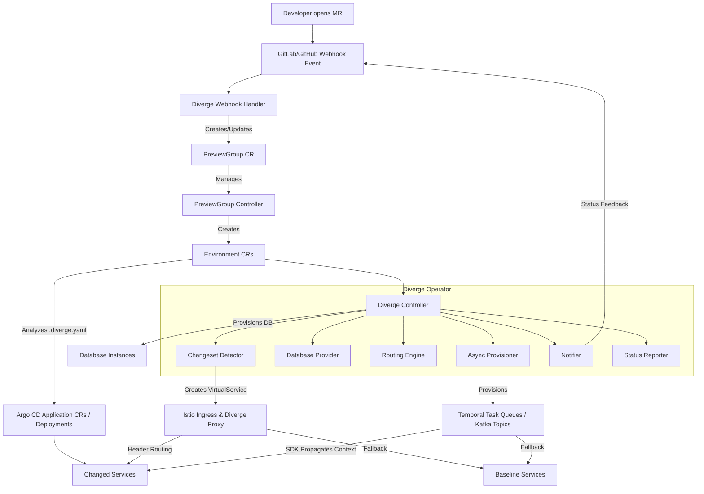

# Diverge Architecture

## Overview
Diverge is an open-source environment-as-a-service engine designed for Kubernetes. It solves the challenge of provisioning and maintaining ephemeral preview environments triggered by code changes, primarily from Merge Requests (MRs). By bridging version control events, infrastructure configuration, and routing intelligence, Diverge allows engineering teams to branch their infrastructure the same way they branch their code.

Instead of deploying full duplicates of complex microservice architectures, Diverge supports delta deployments—only deploying the services that have changed while reusing the unchanged baseline environment.

## System Architecture

## Components

- **PreviewGroup Controller**: Orchestrates multiple `Environment` CRs from a single `PreviewGroup` CR, representing an entire MR's changes together. Ensures all preview services share routing, labels, and lifecycle.
- **Controller**: The Kubernetes controller (reconciler) that watches `Environment` Custom Resources (CRs). It orchestrates the deployment lifecycle, executing state transitions. The controller uses a Provider Registry to dynamically instantiate its integrations (routing, deployment, etc.) without hardcoded switch statements.
  - **Controller Watches**: The controller uses `Owns()` to watch child resources such as `Job` (migrations), `Deployment`, and `Service` (preview pods). This ensures that if child resources are modified or deleted, the controller automatically re-reconciles to restore the desired state.
- **Activator Proxy**: Wakes up idle scaled-to-zero preview pods. It holds requests until the backend is ready, then seamlessly proxies the traffic, injecting necessary routing headers.
- **Proxy**: A reverse proxy that assists with header-based routing, seamlessly directing traffic to the correct preview environment.
- **CLI**: A command-line tool (`diverge`) allowing developers to interact with and manage preview environments directly from their terminal.
- **Webhook Handler**: An HTTP server that listens to GitLab/GitHub webhook events (e.g., MR open, update, merge, close). It translates these events into Kubernetes `Environment` CRs, applying labels for configuration overrides based on MR details.
- **Changeset Detector**: Responsible for identifying which services have been modified in the current branch by performing a git diff and mapping the changed files to service paths defined in `.diverge.yaml`.
- **Database Providers**: Pluggable interfaces to handle database provisioning dynamically according to the requested mode (e.g., creating schemas, restoring from snapshots, or providing fresh databases).
- **Routing Engine**: Configures the underlying service mesh (e.g., Istio) to route traffic appropriately. In header-based mode, it generates Istio `VirtualService` and `DestinationRule` resources.
- **Async Provisioner**: Manages async routing resources like Temporal Task Queues and Kafka topics, ensuring they are provisioned before workloads are started.
- **SDK Context Propagation**: SDK packages (for Go, Python, Node, Java) that transparently propagate the `x-diverge-env` context through headers or metadata, extending routing to async protocols.
- **ArgoCD Deployer**: Generates and manages Argo CD `Application` CRs, supporting both Helm and Kustomize source types.
- **Notifier**: (Optional) Sends status updates back to the Version Control System (like GitLab/GitHub MR/PR comments) regarding deployment progress and preview URLs.
- **Status Reporter**: Posts commit status checks to GitLab/GitHub for merge gating. Supports `pending`, `running`, `success`, `failed`, and `canceled` states with platform-specific mapping. Includes SHA validation (hex-only regex) to prevent path traversal.
- **API Server** (Coming soon - Issue #12): A forthcoming gRPC/ConnectRPC API server for extended environment management and integration. Proto definitions are in `proto/diverge/v1alpha1/`.

## Provider Registry Pattern

Diverge uses a generic `Registry[T]` (located in `pkg/registry/`) to manage its integrations, such as routing, deploying, testing, databases, and notifiers. This self-registration pattern allows you to add custom providers easily.

The flow works as follows:
1. **Define a Registry**: Each integration point has a global `Registry[T]`.
2. **Self-Registration**: Providers register themselves via their package's `init()` function (e.g., in `*_register.go` files) using `Providers.Register()`.
3. **Instantiation**: The `main.go` instantiates the selected provider via `Providers.Create(name, deps)`.

This design makes Diverge highly extensible. Adding a new provider requires creating just one file and zero changes to the core controller `main.go`.

## CRD Design

The core of Diverge involves the `PreviewGroup` and `Environment` Custom Resource Definitions (CRDs).

### PreviewGroup
The `PreviewGroup` acts as the entrypoint for an MR's preview. It defines:
- **Source**: SCM details (gitlab, github) and MR ID.
- **Routing**: Shared routing rules (e.g., header key `x-preview-env`).
- **Services**: A list of microservices included in this preview (mode: image, local, or baseline).

### Environment Spec
The `EnvironmentSpec` dictates the desired state:
- `Source`: Provider (e.g., gitlab), Project name, MR ID, and Branch.
- `Deploy`: Deployment mode (`delta` or `full`), list of changed services, baseline reference, and `namespaceLabels` (custom labels applied to the preview namespace, e.g., `istio.io/dataplane-mode: ambient`).
- `Routing`: Routing mode, header key/value pair, and external URL.
- `Database`: DB mode (`shared`, `schema`, `snapshot`, `fresh`), connection string, and migration commands.
- `Lifecycle`: Time-to-Live (TTL) and cleanup behaviors.

### Status & State Machine
The `EnvironmentStatus` tracks the observed state. Environments use the `diverge.io/finalizer` to ensure a clean teardown of external resources during deletion. Status includes `CommitSHA`, `CommentID`, and `CommitStatusURL` for merge gating integration. The lifecycle of an environment moves through specific phases:
- `Pending`: The environment resource has been created but no action has taken place.
- `Deploying`: The controller is currently provisioning databases, deploying services, and configuring routing rules.
- `Running`: The environment is healthy and actively serving traffic.
- `Failed`: An error occurred during the provisioning or deployment phase.
- `Terminating`: The environment is being dismantled (e.g., after an MR is closed/merged or TTL expiry).

Phase transitions are driven by standard Kubernetes `metav1.Condition` types that track sub-system readiness, specifically: `NamespaceReady`, `DatabaseReady`, `RoutingReady`, and `ServicesReady`.

## Delta Deployment

Diverge employs a Delta Deployment strategy to optimize resources.
When a change occurs, the Changeset Detector performs a `git diff` against the target branch. It compares modified file paths against a configured service path map located in the repository's `.diverge.yaml` file.
Only the modified services are deployed to the Kubernetes cluster. Unmodified services fall back to a baseline environment (e.g., staging). This is powered heavily by the Routing Engine.

## Routing Modes

Diverge supports multiple routing strategies depending on cluster configuration:

- **Header-based (Istio VirtualService)**: The default and most efficient mode. It creates an Istio `VirtualService` that inspects incoming HTTP requests. If the request contains a specific header (e.g., `x-diverge-env: mr-123`), it routes traffic to the delta-deployed services. Otherwise, it falls back to the baseline environment.
- **Gateway API**: Generates Gateway API `HTTPRoute` resources for header-based routing. When `ServicePreviewConfig.PathPrefix` is set, the generated route combines header matching with a `PathPrefix` path match, scoping it to specific API paths (e.g., `/api/payments`) to avoid unintentionally shadowing the entire baseline service.
- **Namespace isolation**: Deploys the entire environment into a dedicated, isolated Kubernetes namespace.
- **Subdomain**: Exposes the environment via a unique subdomain (e.g., `mr-123.preview.example.com`).

## Async Routing

In addition to synchronous HTTP/gRPC routing, Diverge natively supports asynchronous message routing:
- **Temporal Task Queue Routing**: Diverge automatically injects an environment suffix into task queue names, isolating workflow execution to the preview environment.
- **Kafka Topic Routing**: Topic names are dynamically rewritten or isolated by environment suffixes.
- **SDK Context Propagation**: By utilizing Diverge's SDK context propagators, applications automatically forward the environment context across asynchronous boundaries (e.g. from an HTTP request to a Temporal workflow).

## Scale-to-Zero

To minimize cost, Diverge integrates with KEDA HTTP Add-on (`HTTPScaledObject`) for **Scale-to-Zero** capability. Idle preview environments scale down to 0 replicas. When a request hits the cluster with the correct preview header, the **Activator Proxy** holds the request, wakes up the corresponding preview pod, and proxies the traffic once the pod is ready. This can yield upwards of 90% resource savings for rarely-accessed preview environments.

## Database Modes

Database handling is critical for isolated testing. Diverge offers several modes:

- **Shared**: The preview environment connects to the baseline database. Useful for read-only changes or non-destructive migrations.
- **Schema-per-env**: Creates a logical, isolated schema within an existing shared database cluster. A good balance of isolation and speed.
- **Snapshot**: Provisions a new database cloned from a recent production or staging snapshot. Ideal for realistic testing.
- **Fresh**: Provisions an entirely new, empty database instance and optionally runs seed scripts.

## Database Schema Isolation

When using `schema` mode for PostgreSQL, Diverge ensures isolation by:
1. **Schema Creation**: Provisioning a unique, sanitized schema specific to the preview environment.
2. **Search Path Injection**: Automatically generating a connection Secret with a `DATABASE_URL` that includes the schema in the `search_path` (e.g., `?search_path=diverge_env_mr_1`).
3. **Migration Job Lifecycle**: Dispatched a Kubernetes `Job` to run database migrations against the new schema. The controller watches this Job via `Owns()`, holding the `DatabaseReady` condition until the migration completes successfully.

## Lifecycle Management

Diverge prevents cluster bloat through automated lifecycle management:

- **Cleanup on merge/close**: When an MR is merged or closed, the webhook handler signals the controller to change the CR phase to `Terminating`, triggering teardown.
- **TTL**: Environments can have a configured Time-To-Live (e.g., 7 days) to ensure stale environments are automatically garbage-collected.
- **Garbage Collection**: Reaps orphaned resources that no longer have a corresponding active MR.

## Preview Labels

Diverge employs a labeling strategy on generated resources for routing and traceability. Not all labels are present on every resource type:

| Label | Deployments | Services | Jobs | HTTPRoutes |
|-------|:-----------:|:--------:|:----::|:----------:|
| `app` (preview name) | ✅ | ✅ | — | — |
| `diverge.io/service` (baseline name) | ✅ | — | — | — |
| `diverge.io/environment` | ✅ | ✅ | ✅ | ✅ |
| `diverge.io/managed-by` | ✅ | ✅ | ✅ | ✅ |
| `diverge.io/role` | ✅ | ✅ | — | — |
| `diverge.io/preview-id` | ✅ | ✅ | — | — |

## Integration Points

Diverge seamlessly integrates into the modern cloud-native stack:
- **VCS**: GitLab and GitHub webhooks drive the automation.
- **CD**: Often pairs with Argo CD (e.g., via direct `Application` CRs) to apply manifests.
- **Mesh**: Istio provides the underlying header-based routing fabric.
- **Infrastructure**: Crossplane can be utilized by the Database Providers to dynamically provision cloud-managed databases (like RDS or Cloud SQL).

## Security Architecture

Diverge incorporates secure-by-default design principles:
- **Webhook Security**: Employs constant-time token validation to prevent timing attacks.
- **Input Validation**: Enforces strict YAML parsing (disallowing unknown fields) and validates `HeaderKey` values against RFC 7230 token format constraints.
- **Safe SHA Validation**: Commit SHAs are validated against a hex-only regex (`^[0-9a-fA-F]{4,64}$`) safely without panicking, preventing path traversal via crafted SHA values.
- **Path Traversal Prevention**: Ensures GitHub/GitLab notifier providers are safeguarded against path traversal vulnerabilities in project paths and commit SHAs.
- **Label Validation**: Namespace label keys and values are strictly validated using `k8s.io/apimachinery/pkg/util/validation` before being applied. `diverge.io/*` labels are protected from user override.
- **SQL Injection Prevention**: Schema names are validated against a strict regex (`^[a-z][a-z0-9_]{0,62}$`) before use in DDL statements, since parameterized queries cannot be used for schema operations. The `SQLExecutor` ensures safe execution.
- **ArgoCD Security**: Enforces namespace bypass prevention for ArgoCD Application generation.
- **Network Security**: Uses IPv6-safe pod URLs.
- **Resource Constraints**: Applies context timeouts on all external network and API calls to prevent hanging routines.
- **Safe Resource Updates**: Uses Typed Server-Side Apply (SSA) for accurate and safe API object modifications.
- **Least Privilege**: The controller runs with strictly RBAC-scoped permissions, acquiring only the access necessary for its operational scope.

## Observability

The controller provides rich observability by emitting standard Kubernetes events (`Normal` and `Warning`) during all key lifecycle transitions, failures, and teardowns, ensuring tight integration with existing cluster monitoring tools.
