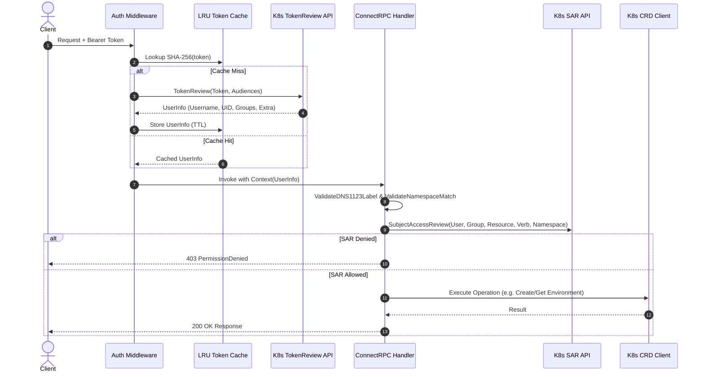

# Authentication and Authorization Guide

Diverge provides a Kubernetes-native authentication and authorization model for its ConnectRPC API server. Instead of maintaining an independent user database, Diverge delegates all identity verification and access control directly to the Kubernetes API server using standard `TokenReview` and `SubjectAccessReview` (SAR) primitives.

This guide explains how authentication and authorization work in Diverge, how to configure RBAC for different user personas, how to tune the token cache, and how to troubleshoot common security errors.

---

## Architecture and Request Flow

Every incoming API request passes through a multi-stage security pipeline:



### 1. TokenReview Authentication
When a client sends an HTTP request with an `Authorization: Bearer <token>` header:
- The server computes the SHA-256 hash of the token and checks the bounded in-memory LRU cache.
- On a cache miss, the server issues a `TokenReview` (`authentication.k8s.io/v1`) request to the Kubernetes API server, verifying the token's validity, expiration, and audience claims (`--audiences`).
- If authenticated, the Kubernetes API server returns the user's identity: `Username`, `UID`, `Groups`, and `Extra` attributes (e.g., OIDC claims).
- Successful authentications are cached. Failed authentication attempts are **never cached**.

> [!NOTE]
> Endpoints `/healthz` and `/readyz` bypass authentication middleware entirely.

### 2. SubjectAccessReview Authorization
For each API operation (unary RPC or stream), the Diverge server verifies that the authenticated user has appropriate Kubernetes RBAC permissions:
- **Diverge Resources**: Performs a `SubjectAccessReview` (`authorization.k8s.io/v1`) with `group: "diverge.dev"` (or `"diverge.io"`), the target `resource` (`environments` or `previewgroups`), `verb` (`get`, `list`, `watch`, `create`, `update`, `delete`), and `namespace`.
- **Pod Logs (`StreamLogs`)**: Requires both environment read access and core `pods/log` access (`group: ""`, `resource: "pods"`, `subresource: "log"`, `verb: "get"`).
- **Namespace Isolation**: `ValidateNamespaceMatch` enforces that the request wrapper namespace strictly matches the metadata namespace in the payload, preventing RBAC bypasses.

---

## Obtaining and Using Tokens

Clients authenticate to the Diverge server using Bearer tokens.

### 1. Developer Tokens with `kubectl`
For local development or testing, generate a short-lived token for an existing ServiceAccount:

```bash
kubectl create token <service-account-name> \
  --namespace <namespace> \
  --audience diverge-server \
  --duration 8h
```

Export the token and pass it in the `Authorization` header:

```bash
export DIVERGE_TOKEN=$(kubectl create token developer -n default --audience diverge-server)

curl -X POST https://diverge.example.com/diverge.v1alpha1.EnvironmentService/ListEnvironments \
  -H "Authorization: Bearer $DIVERGE_TOKEN" \
  -H "Content-Type: application/json" \
  -d '{"namespace": "default"}'
```

### 2. OIDC Identity Providers (Keycloak, Zitadel, Auth0, Okta)
When your Kubernetes cluster is configured with OIDC authentication (via `--oidc-issuer-url`, `--oidc-client-id`, `--oidc-username-claim`, and `--oidc-groups-claim` on `kube-apiserver`):
1. The user logs in via your OIDC provider and receives an ID token (JWT).
2. The client provides this JWT as `Bearer <id-token>` in requests to the Diverge server.
3. The Diverge server submits the token to `kube-apiserver` via `TokenReview`.
4. `kube-apiserver` validates the signature against the OIDC provider and populates `UserInfo.Groups` based on the user's IdP group memberships.

> [!IMPORTANT]
> Ensure the OIDC token includes the audience configured in Diverge's `--audiences` flag, or configure `--audiences` on the Diverge server to match the OIDC client ID.

### 3. CI/CD ServiceAccounts (GitHub Actions / GitLab CI)
Create a dedicated `ServiceAccount` in each application namespace for your CI/CD pipelines:

```yaml
apiVersion: v1
kind: ServiceAccount
metadata:
  name: diverge-ci
  namespace: team-alpha
```

In your CI pipeline, acquire a bound token:

```yaml
# Example GitLab CI / GitHub Actions step
- name: Generate Token
  run: |
    TOKEN=$(kubectl create token diverge-ci --namespace team-alpha --audience diverge-server --duration 1h)
    echo "DIVERGE_TOKEN=$TOKEN" >> $GITHUB_ENV
```

---

## RBAC Configuration

Define Kubernetes `Role` (or `ClusterRole`) and `RoleBinding` manifests to grant permissions based on the persona principle.

### 1. Read-Only Persona
Suitable for QA engineers, stakeholders, and dashboard viewers who only need visibility.

```yaml
apiVersion: rbac.authorization.k8s.io/v1
kind: Role
metadata:
  name: diverge-viewer
  namespace: team-alpha
rules:
  - apiGroups: ["diverge.dev", "diverge.io"]
    resources: ["environments", "previewgroups"]
    verbs: ["get", "list", "watch"]
---
apiVersion: rbac.authorization.k8s.io/v1
kind: RoleBinding
metadata:
  name: diverge-viewer-binding
  namespace: team-alpha
subjects:
  - kind: Group
    name: "oidc:qa-team"
    apiGroup: rbac.authorization.k8s.io
roleRef:
  kind: Role
  name: diverge-viewer
  apiGroup: rbac.authorization.k8s.io
```

### 2. Developer Persona
Allows developers and CI/CD pipelines to manage preview environments and stream pod logs within their assigned namespace.

```yaml
apiVersion: rbac.authorization.k8s.io/v1
kind: Role
metadata:
  name: diverge-developer
  namespace: team-alpha
rules:
  - apiGroups: ["diverge.dev", "diverge.io"]
    resources: ["environments"]
    verbs: ["get", "list", "watch", "create", "update", "delete"]
  - apiGroups: ["diverge.dev", "diverge.io"]
    resources: ["previewgroups"]
    verbs: ["get", "list", "watch"]
  - apiGroups: [""]
    resources: ["pods/log"]
    verbs: ["get"]
---
apiVersion: rbac.authorization.k8s.io/v1
kind: RoleBinding
metadata:
  name: diverge-developer-binding
  namespace: team-alpha
subjects:
  - kind: Group
    name: "oidc:developers"
    apiGroup: rbac.authorization.k8s.io
  - kind: ServiceAccount
    name: diverge-ci
    namespace: team-alpha
roleRef:
  kind: Role
  name: diverge-developer
  apiGroup: rbac.authorization.k8s.io
```

### 3. Cluster Admin Persona
Grants full cluster-wide management of all Diverge resources and pod inspection capabilities.

```yaml
apiVersion: rbac.authorization.k8s.io/v1
kind: ClusterRole
metadata:
  name: diverge-admin
rules:
  - apiGroups: ["diverge.dev", "diverge.io"]
    resources: ["environments", "previewgroups"]
    verbs: ["*"]
  - apiGroups: [""]
    resources: ["pods"]
    verbs: ["get", "list"]
  - apiGroups: [""]
    resources: ["pods/log"]
    verbs: ["get"]
---
apiVersion: rbac.authorization.k8s.io/v1
kind: ClusterRoleBinding
metadata:
  name: diverge-admin-binding
subjects:
  - kind: Group
    name: "oidc:platform-admins"
    apiGroup: rbac.authorization.k8s.io
roleRef:
  kind: ClusterRole
  name: diverge-admin
  apiGroup: rbac.authorization.k8s.io
```

### Diverge Server's Own RBAC Requirements
For the Diverge server to evaluate auth requests and stream logs, its own ServiceAccount requires:
- `authentication.k8s.io` `tokenreviews`: `create`
- `authorization.k8s.io` `subjectaccessreviews`: `create`
- `diverge.io` `environments`, `previewgroups`: `*`
- Core `pods`, `pods/log`: `get`, `list` (configured cluster-wide via `server.rbac.clusterWidePodAccess` or restricted via `server.rbac.targetNamespaces`).

These permissions are automatically deployed when using the Diverge Helm chart.

---

## Token Cache Tuning

To prevent overwhelming the Kubernetes API server with `TokenReview` requests on every RPC call, the Diverge server maintains a bounded in-memory LRU cache.

```
Incoming Request -> SHA-256(Token) -> Cache Key -> [LRU Cache: Max 1024 Entries] -> UserInfo
```

### Configuration Flags
Configure token caching in `values.yaml` or via command-line flags:

| Flag | Helm Key | Default | Description |
| :--- | :--- | :--- | :--- |
| `--token-cache-ttl` | `server.auth.tokenCacheTTL` | `5s` | Duration to cache successful TokenReview results |
| `--audiences` | `server.auth.audiences` | `diverge-server` | Comma-separated list of expected token audience claims |

### Invalidation Semantics
1. **TTL-Based Eviction**: An entry is invalidated once `time.Now() > expiresAt`.
2. **LRU Eviction**: The cache holds up to 1024 entries. When full, the least recently used entry is evicted.
3. **Failures Are Never Cached**: Only successful authentications enter the cache. Revoked or invalid tokens fail immediately on every attempt.
4. **Security by Hashing**: The cache stores keys as `SHA-256(token)`. Raw tokens are never retained in memory.

### Tuning Recommendations
- **Interactive Dashboards / High RPS**: Set `--token-cache-ttl=30s` to reduce `kube-apiserver` CPU load.
- **High-Security Environments**: Keep `--token-cache-ttl=5s` (default) so revoked ServiceAccount tokens or modified IdP group memberships take effect within seconds.
- **Disable Caching**: Setting TTL to `0s` forces a live `TokenReview` for every request.

---

## TLS and Network Security Requirements

> [!CAUTION]
> In production environments, TLS is mandatory. Transmitting bearer tokens over unencrypted HTTP exposes credentials to network sniffing and man-in-the-middle attacks.

### Enabling TLS on Diverge Server
Provide certificate and private key files using CLI flags or Helm:

```bash
diverge-server \
  --addr=:8443 \
  --tls-cert-file=/etc/diverge/tls/tls.crt \
  --tls-key-file=/etc/diverge/tls/tls.key
```

### Ingress & Gateway API Termination
If terminating TLS at an Ingress controller (e.g., NGINX, Traefik) or Gateway (Envoy):
1. Enforce HTTPS redirection at the edge.
2. Maintain mutual TLS (mTLS) or secure internal network paths between ingress and Diverge pods.

### Secure CORS Configuration
When accessing Diverge from web applications, restrict `--cors-allowed-origins` to your trusted domains. Never leave CORS set to wildcard (`*`) in production when handling credentials:

```yaml
# Helm values.yaml
server:
  cors:
    allowedOrigins: "https://app.diverge.dev,https://dashboard.internal.company.com"
    maxAge: 86400
```

---

## Troubleshooting Auth Errors

| Error Code | Error Message / Symptom | Probable Cause | Resolution |
| :--- | :--- | :--- | :--- |
| `401 Unauthorized` | `missing or invalid authorization header` | Missing `Authorization` header or prefix is not `Bearer`. | Ensure request header contains `Authorization: Bearer <token>`. |
| `401 Unauthorized` | `authentication failed` / `token not authenticated` | Token has expired, has invalid signature, or audience mismatch. | Check token expiration. Verify `--audiences` matches the token audience claim (`aud`). |
| `403 PermissionDenied` | `permission denied` | User authenticated, but lacks RBAC permissions for the verb/resource in the target namespace. | Check RBAC rules with `kubectl auth can-i`: <br>`kubectl auth can-i create environments.diverge.dev -n <ns> --as=<user> --as-group=<group>` |
| `403 PermissionDenied` | `permission denied: requires get access to pods/log` | User lacks `pods/log` permission, or Diverge server is missing namespace RBAC. | Add `pods/log` to user's Role. If using namespace scoping, ensure namespace is in `server.rbac.targetNamespaces`. |
| `400 InvalidArgument` | `namespace mismatch: request namespace does not match resource namespace` | `req.Namespace` differs from `req.Environment.Namespace`. | Ensure the namespace in the request envelope matches the resource metadata namespace. |
| `500 Internal` | `authorization check failed` | Diverge server ServiceAccount cannot create `SubjectAccessReviews`. | Verify the `diverge-server-auth` `ClusterRoleBinding` is active for the server ServiceAccount. |

### Inspecting Audit Logs
Diverge emits structured JSON audit logs for security monitoring. Filter for auth events in pod logs:

```bash
kubectl logs -n diverge-system -l app.kubernetes.io/component=server | jq 'select(.event | startswith("auth"))'
```

Example audit failure log:
```json
{
  "time": "2026-08-23T19:00:00Z",
  "level": "WARN",
  "msg": "auth.failure",
  "reason": "token_review_rejected",
  "path": "/diverge.v1alpha1.EnvironmentService/CreateEnvironment",
  "source_ip": "10.244.0.1:45232"
}
```
