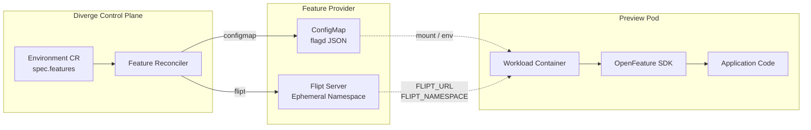

# Feature Flags Guide

Diverge provides first-class support for feature flag management in preview environments, built on top of the CNCF [OpenFeature](https://openfeature.dev/) standard.

When deploying ephemeral preview environments, you often need to validate code paths gated behind specific feature flags, test variants, or verify experimental features without altering flags across shared staging or production environments. Diverge automates this by isolating feature flag configurations per preview environment.



---

## Key Benefits

- **Zero Blast Radius**: Flags toggled in a preview environment never leak into baseline staging or production.
- **OpenFeature Native**: Applications use standard OpenFeature SDKs (Go, Node.js, Python, Java, etc.) without proprietary lock-in.
- **Automatic Lifecycle Cleanup**: Remote namespaces and ConfigMaps are automatically deleted when the preview environment expires or merges.
- **Dual-Tier Credentials**: Seamlessly use team-scoped or cluster-wide provider secrets with automatic fallback.
- **Dashboard Visibility**: Inspect active flags, override values, and launch directly into provider consoles from the Diverge UI.

---

## Supported Providers

| Provider | Description | Best For |
|---|---|---|
| `configmap` *(default)* | Generates an in-cluster Kubernetes ConfigMap formatted for the OpenFeature `flagd` provider. | Zero external infrastructure; lightweight, standalone preview clusters. |
| `flipt` | Provisions an ephemeral namespace (`diverge-<envName>`) in a remote or in-cluster [Flipt](https://flipt.io) instance. | Teams already using Flipt for feature flags or requiring advanced rollout strategies and audit logs. |
| `flagsmith` | Provisions an ephemeral identity (`diverge-<envName>`) and standard traits (`diverge_environment`, `diverge_namespace`, `diverge_preview`) in remote or self-hosted Flagsmith. | Teams using Flagsmith for feature flag management with identity and trait targeting. |
| `unleash` | Preview stub. Planned full synchronization with Unleash strategies and contexts. | Tracked in [Issue #268](https://github.com/divergedev/diverge/issues/268). |
| `noop` / `none` | Disables feature flag synchronization for this environment. | Environments where feature flag synchronization is intentionally skipped. |

---

## Configuration Reference

### 1. In-Cluster ConfigMap Provider (`flagd`)

The `configmap` provider requires no external servers. Diverge creates a Kubernetes ConfigMap containing a flag definition with JSONLogic rules targeting the environment name:

```yaml
apiVersion: divergedev.com/v1alpha1
kind: Environment
metadata:
  name: pr-1234
  namespace: diverge-previews
spec:
  routing:
    mode: header
    headerKey: x-diverge-env
    headerValue: pr-1234
  features:
    provider: configmap
    overrides:
      new_checkout_flow: "true"
      beta_recommendations: "false"
      max_items_limit: "50"
      algorithm_version: "v2-ml"
```

Diverge automatically updates the Environment's status:
- `status.featureConfigMap`: `<env-name>-features`
- `status.featureEnvVars`:
  - `DIVERGE_FEATURE_CONFIGMAP`: `<env-name>-features`
  - `FLAGD_FLAG_PATH`: `/etc/diverge/flags.json`

### 2. Flipt Provider

The `flipt` provider manages ephemeral namespaces in a Flipt server. Diverge automatically synchronizes boolean and variant flags, and removes the namespace when the preview environment is torn down:

```yaml
apiVersion: divergedev.com/v1alpha1
kind: Environment
metadata:
  name: pr-1234
  namespace: diverge-previews
spec:
  features:
    provider: flipt
    connectionRef: flipt-credentials
    overrides:
      enable_redesign: "true"
      experiment_tier: "enterprise"
      rate_limit_rpm: "5000"
```

#### Secret Configuration (`connectionRef`)

Diverge looks up the secret in the Environment's namespace first, falling back to the `diverge-system` controller namespace:

```yaml
apiVersion: v1
kind: Secret
metadata:
  name: flipt-credentials
  namespace: diverge-previews # Or diverge-system
type: Opaque
stringData:
  url: "https://flipt.internal.example.com"
  clientToken: "flipt_client_secret..."    # Injected into workloads
  adminToken: "flipt_admin_secret..."      # Used by Diverge controller for provisioning
```

Injected Pod environment variables:
- `FLIPT_URL`: URL of the Flipt server.
- `FLIPT_NAMESPACE`: `diverge-<envName>`
- `FLIPT_AUTH_TOKEN`: Client authentication token (if configured).

### 3. Flagsmith Provider

The `flagsmith` provider creates an ephemeral identity (`diverge-<envName>`) in Flagsmith with standard preview traits and applies identity-level feature flag overrides. When the environment is deleted, the ephemeral identity and its overrides are automatically cleaned up:

```yaml
apiVersion: divergedev.com/v1alpha1
kind: Environment
metadata:
  name: pr-1234
  namespace: diverge-previews
spec:
  features:
    provider: flagsmith
    connectionRef: flagsmith-credentials
    overrides:
      checkout_v2: "true"
      max_items_limit: "50"
      discount_rate: "0.15"
      experiment_cohort: "beta"
```

#### Secret Configuration (`connectionRef`)

Diverge looks up the secret in the Environment's namespace first, falling back to the `diverge-system` controller namespace:

```yaml
apiVersion: v1
kind: Secret
metadata:
  name: flagsmith-credentials
  namespace: diverge-previews # Or diverge-system
type: Opaque
stringData:
  url: "https://edge.api.flagsmith.com/api/v1"
  environmentKey: "flagsmith_env_key..." # Injected into workloads
  masterApiKey: "flagsmith_admin_key..." # Used by Diverge controller for provisioning
```

Injected Pod environment variables:
- `FLAGSMITH_ENVIRONMENT_KEY`: Client environment key for flag evaluation.
- `FLAGSMITH_API_URL`: Base API URL for Flagsmith.
- `FLAGSMITH_IDENTITY`: `diverge-<envName>`
- `OPENFEATURE_FLAGSMITH_ENVIRONMENT_KEY`: Standard OpenFeature client key.
- `OPENFEATURE_FLAGSMITH_API_URL`: Standard OpenFeature Flagsmith URL.
- `OPENFEATURE_TARGET_KEY`: `diverge-<envName>` (evaluates against the ephemeral identity)

Standard traits automatically injected for identity targeting:
- `diverge_environment`: `<envName>`
- `diverge_namespace`: `<namespace>`
- `diverge_preview`: `true`

---

## Application Integration (OpenFeature)

Workloads read standard environment variables automatically injected by Diverge. You do not need to hardcode environment names or URLs in your application code.

### Go

Install the OpenFeature SDK and your provider of choice:

```bash
go get github.com/open-feature/go-sdk
# For flagd / ConfigMap:
go get github.com/open-feature/go-sdk-contrib/providers/flagd
# For Flipt:
go get github.com/open-feature/go-sdk-contrib/providers/flipt
```

Initialize the provider based on injected environment variables:

```go
package main

import (
	"context"
	"log"
	"os"

	"github.com/open-feature/go-sdk/openfeature"
	flagd "github.com/open-feature/go-sdk-contrib/providers/flagd/pkg/service/in-process"
	flipt "github.com/open-feature/go-sdk-contrib/providers/flipt/pkg/provider"
)

func initFeatureClient() openfeature.IClient {
	if fliptURL := os.Getenv("FLIPT_URL"); fliptURL != "" {
		// Connected via Diverge Flipt provider
		namespace := os.Getenv("FLIPT_NAMESPACE")
		token := os.Getenv("FLIPT_AUTH_TOKEN")
		
		provider := flipt.NewProvider(
			flipt.WithAddress(fliptURL),
			flipt.WithNamespace(namespace),
			flipt.WithClientToken(token),
		)
		openfeature.SetProvider(provider)
	} else if flagPath := os.Getenv("FLAGD_FLAG_PATH"); flagPath != "" {
		// Connected via Diverge ConfigMap (flagd) provider
		provider := flagd.NewProvider(flagd.WithFlagPath(flagPath))
		openfeature.SetProvider(provider)
	} else {
		// Default fallback / no-op provider for local unit testing
		openfeature.SetProvider(openfeature.NoopProvider{})
	}

	return openfeature.NewClient("preview-service")
}

func main() {
	client := initFeatureClient()
	ctx := context.Background()

	// Evaluate boolean flag
	isCheckoutEnabled, err := client.BooleanValue(ctx, "new_checkout_flow", false, openfeature.EvaluationContext{})
	if err != nil {
		log.Printf("Error evaluating flag: %v", err)
	}

	// Evaluate variant / string flag
	tier, _ := client.StringValue(ctx, "experiment_tier", "standard", openfeature.EvaluationContext{})

	log.Printf("Checkout Enabled: %t, Tier: %s", isCheckoutEnabled, tier)
}
```

---

### Node.js / TypeScript

Install the OpenFeature server SDK and providers:

```bash
npm install @openfeature/server-sdk
# For flagd / ConfigMap:
npm install @openfeature/flagd-provider
# For Flipt:
npm install @openfeature/flipt-provider
```

Initialize the client:

```typescript
import { OpenFeature } from '@openfeature/server-sdk';
import { FlagdProvider } from '@openfeature/flagd-provider';
import { FliptProvider } from '@openfeature/flipt-provider';

export async function setupFeatureFlags() {
  if (process.env.FLIPT_URL) {
    const provider = new FliptProvider({
      url: process.env.FLIPT_URL,
      namespace: process.env.FLIPT_NAMESPACE,
      clientToken: process.env.FLIPT_AUTH_TOKEN,
    });
    await OpenFeature.setProviderAndWait(provider);
  } else if (process.env.FLAGD_FLAG_PATH) {
    const provider = new FlagdProvider({
      path: process.env.FLAGD_FLAG_PATH,
    });
    await OpenFeature.setProviderAndWait(provider);
  }

  return OpenFeature.getClient();
}

async function run() {
  const client = await setupFeatureFlags();

  const isCheckoutEnabled = await client.getBooleanValue('new_checkout_flow', false);
  const tier = await client.getStringValue('experiment_tier', 'standard');

  console.log({ isCheckoutEnabled, tier });
}
```

---

### Python

Install the OpenFeature Python SDK:

```bash
uv pip install openfeature-sdk
# For flagd:
uv pip install openfeature-provider-flagd
```

Usage:

```python
import os
from openfeature import api
from openfeature.contrib.provider.flagd import FlagdProvider

def setup_flags():
    flag_path = os.getenv("FLAGD_FLAG_PATH")
    if flag_path:
        api.set_provider(FlagdProvider(flag_path=flag_path))
    else:
        # Fallback or Flipt provider
        pass

    return api.get_client()

client = setup_flags()
is_checkout_enabled = client.get_boolean_value("new_checkout_flow", False)
variant = client.get_string_value("experiment_tier", "standard")
print(f"Checkout: {is_checkout_enabled}, Variant: {variant}")
```

---

## Diverge Web Dashboard

The Diverge Dashboard provides an interactive **Flags** tab for every preview environment:

1. **Provider Badge & Status**: See at a glance whether the environment is backed by `configmap`, `flipt`, or another provider.
2. **Flag Overrides Table**:
   - Inspect all configured flags.
   - Values like `true`/`false` are rendered as Boolean pills; other values are rendered as Variant strings.
   - Status chips indicate active evaluation state.
3. **External Console Links**:
   - For `flipt` environments, click **Open Flipt Console** to jump directly to the ephemeral namespace in your Flipt admin UI.
   - For `configmap` environments, view the generated ConfigMap details directly.

---

## Troubleshooting

### Flipt Namespace Not Provisioning
- Verify that `connectionRef` points to a valid Secret containing `url` and `adminToken`.
- Check controller logs for connection or timeout errors:
  ```bash
  kubectl logs -n diverge-system deploy/diverge-controller-manager -c manager | grep -i flipt
  ```

### Workload Not Receiving Injected Environment Variables
- Ensure your preview environment spec defines `features.provider`.
- Check the `Environment` status to confirm `status.featureEnvVars` is populated:
  ```bash
  kubectl get environment <name> -o jsonpath='{.status.featureEnvVars}'
  ```

### Flag Evaluation Returning Default Value
- Check that the flag key matches exactly between your code and `spec.features.overrides`. Flag keys are case-sensitive.
- For `configmap` provider, verify that your pod has mounted the ConfigMap or is passing the correct path in `FLAGD_FLAG_PATH`.
