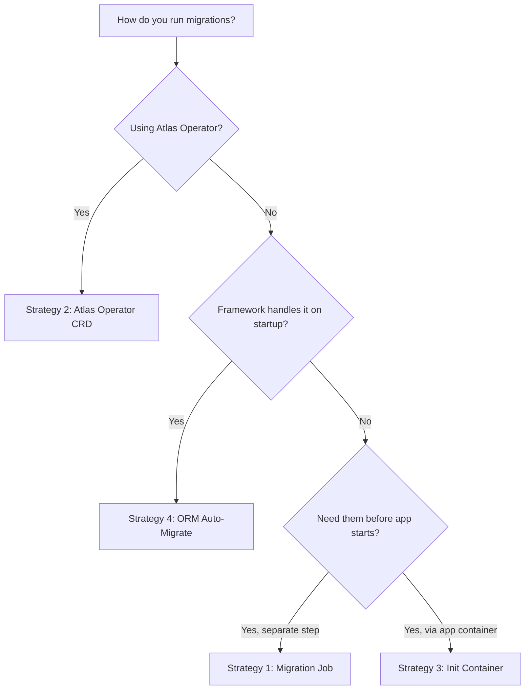

# Database Migration Hooks

Diverge automatically creates isolated database schemas for preview environments.
Migration hooks let you apply schema migrations and seed data to these schemas.

## Choosing a Strategy



## Strategy 1: Migration Job (Recommended)

Diverge creates a Kubernetes Job with your migration image. `DATABASE_URL` is
automatically injected via a Secret — never as plaintext.

### Configuration
```yaml
apiVersion: diverge.io/v1alpha1
kind: PreviewGroup
metadata:
  name: api-preview
spec:
  database:
    mode: schema
    connectionRef: db-credentials
    migrationJob:
      image: registry.example.com/myapp-migrations:latest
      args: ["migrate", "apply", "--url", "$(DATABASE_URL)"]
      timeoutSeconds: 120
      blocking: true  # default
  services:
    - name: api
      image: registry.example.com/myapp:latest
```

### Examples

#### Atlas
```yaml
    migrationJob:
      image: arigaio/atlas:latest-alpine
      args: ["migrate", "apply", "--url", "$(DATABASE_URL)", "--dir", "file:///migrations"]
```

#### Flyway (Java)
```yaml
    migrationJob:
      image: flyway/flyway:latest
      args: ["-url=$(DATABASE_URL)", "migrate"]
```

#### Alembic (Python)
```yaml
    migrationJob:
      image: registry.example.com/myapp:latest
      args: ["alembic", "upgrade", "head"]
```

#### Goose (Go)
```yaml
    migrationJob:
      image: registry.example.com/myapp-goose:latest
      args: ["goose", "postgres", "$(DATABASE_URL)", "up"]
```

#### Prisma (Node.js)
```yaml
    migrationJob:
      image: registry.example.com/myapp:latest
      args: ["npx", "prisma", "migrate", "deploy"]
```

#### Django
```yaml
    migrationJob:
      image: registry.example.com/myapp:latest
      args: ["python", "manage.py", "migrate"]
```

#### Rails
```yaml
    migrationJob:
      image: registry.example.com/myapp:latest
      args: ["bin/rails", "db:migrate"]
```

## Strategy 2: Atlas Operator

If you have the [Atlas Operator](https://atlasgo.io/integrations/kubernetes/operator)
installed, Diverge can create `AtlasMigration` or `AtlasSchema` custom resources
directly. The operator handles schema diffing, safety checks, and execution.

### Versioned Migrations
```yaml
apiVersion: diverge.io/v1alpha1
kind: PreviewGroup
metadata:
  name: api-preview
spec:
  database:
    mode: schema
    connectionRef: db-credentials
    atlas:
      mode: versioned
      migrationConfigMap: api-migrations  # ConfigMap with .sql files + atlas.sum
      policy:
        destructive: error  # block destructive changes
```

### Declarative Schema
```yaml
apiVersion: diverge.io/v1alpha1
kind: PreviewGroup
metadata:
  name: api-preview
spec:
  database:
    mode: schema
    connectionRef: db-credentials
    atlas:
      mode: declarative
      schemaConfigMap: api-schema  # ConfigMap with schema.sql or schema.hcl
```

## Strategy 3: Init Container

For simple setups, add an init container to your Deployment. The standard Diverge
environment variable injection automatically provides `DATABASE_URL` to all
containers in the pod, including init containers.

## Strategy 4: ORM Auto-Migrate

If your ORM handles migrations on startup (GORM, Ent, Prisma, TypeORM),
no hook is needed. `DATABASE_URL` is automatically injected into your main
container, and your ORM will execute migrations when the application starts.

## Post-Deploy Hooks

Generic hooks that run after deployment succeeds. Use for seed data, smoke tests,
or cache warming. Configured per-service on `PreviewGroupServiceSpec`:

```yaml
apiVersion: diverge.io/v1alpha1
kind: PreviewGroup
metadata:
  name: api-preview
spec:
  database:
    mode: schema
    connectionRef: db-credentials
    migrationJob:
      image: registry.example.com/myapp-migrations:latest
      args: ["migrate", "apply", "--url", "$(DATABASE_URL)"]
  services:
    - name: api
      image: registry.example.com/myapp:latest
      postDeploy:
        image: registry.example.com/myapp-seed:latest
        args: ["npm", "run", "seed"]
        timeoutSeconds: 60
        blocking: false  # default
```

## Blocking Behavior

| Hook Type | Default | Description |
|-----------|---------|-------------|
| `migrationJob` | `blocking: true` | Environment stays in `Migrating` phase until the Job succeeds. |
| `atlas` | `blocking: true` | Waits for Atlas Operator to report `Ready` condition. |
| `postDeploy` | `blocking: false` | Runs asynchronously. Does not delay the environment reaching `Running`. |

Set `blocking: false` on migration hooks if you want non-blocking migrations
(status reported via `status.migrationStatus`). Set `blocking: true` on
post-deploy hooks to gate the `Running` phase on hook completion.

## Troubleshooting

- **Migration Timeout**: Increase `timeoutSeconds`. Check database connectivity.
- **ImagePullBackOff**: Verify registry credentials and image path.
- **Permission Denied**: Check PodSecurityPolicy or security context restrictions.
- **Failed Status**: View hook Job logs in the Diverge dashboard or via
  `kubectl logs job/migrate-<env>-<hash>`.
