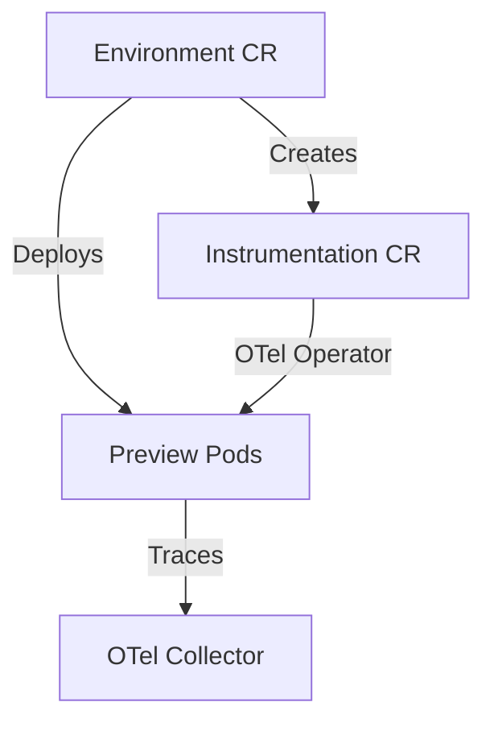

# OpenTelemetry Auto-Instrumentation

Diverge can automatically instrument your preview environments using the OpenTelemetry Operator.

## 1. How It Works



When an Environment is created, Diverge detects if the OTel Operator is installed. It provisions an `Instrumentation` CR and injects annotations (`instrumentation.opentelemetry.io/inject-*`) into your preview workloads. The OTel Operator then mutates the pods to include auto-instrumentation sidecars or init containers.

## 2. Prerequisites

- **OpenTelemetry Operator**: Must be installed in your cluster.
- **OpenTelemetry Collector**: Should be configured to receive OTLP traces. A servicegraph processor is recommended to visualize dependencies between your baseline and preview services.

## 3. Enable in Helm Values

Enable the feature in your Diverge Helm values:

```yaml
observability:
  autoInstrumentation:
    enabled: true
    endpoint: "http://otel-collector.observability:4317"
    go:
      enabled: false # eBPF needs CAP_SYS_PTRACE
```

## 4. Verifying Instrumentation

To verify that your preview pods are instrumented, check the pod annotations and containers:
```bash
kubectl get pods -n <preview-namespace> -o yaml | grep instrumentation.opentelemetry.io
```
You should see OTel init containers injected into the pod.

## 5. Per-Language Customization

Auto-instrumentation supports Java, Node.js, Python, and .NET out of the box. The OTel Operator will automatically inject the appropriate agent based on the language.

## 6. Go Services

Go auto-instrumentation requires eBPF, which needs elevated privileges (`CAP_SYS_PTRACE`). For this reason, it is disabled by default. We recommend using manual instrumentation (OTel Go SDK) for Go services, or enabling eBPF if you accept the security implications.
