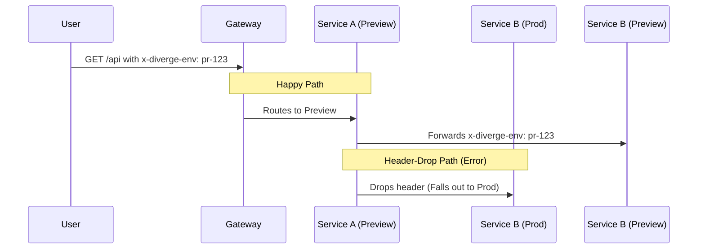

# Header Propagation

## Why Header Propagation Matters

In Diverge, preview environments use HTTP headers to dynamically route requests to the correct version of a service. 

If a service in the call chain fails to forward this header to downstream services, the request "falls out" of the preview environment and incorrectly hits the production version.



## How It Works

1. The initial request to the cluster includes the header `x-diverge-env: <env-name>`.
2. The Gateway routes based on this header to the correct preview instance.
3. Every service in the call chain **MUST propagate** the header when making outbound calls to downstream services.
4. While the service mesh sidecar handles the network routing based on the header, the **APPLICATION** is responsible for reading the header from the incoming request and attaching it to the outgoing request.

## SDK Examples

Here are copy-paste examples of middleware to automatically capture and propagate the Diverge header in various languages and frameworks.

### Go (net/http)

```go
func PropagateHeaders(next http.Handler) http.Handler {
    return http.HandlerFunc(func(w http.ResponseWriter, r *http.Request) {
        // Store diverge header in context for outbound calls
        ctx := r.Context()
        if env := r.Header.Get("x-diverge-env"); env != "" {
            ctx = context.WithValue(ctx, divergeEnvKey, env)
        }
        next.ServeHTTP(w, r.WithContext(ctx))
    })
}
```

### Go (Diverge SDK)

Using the official Diverge SDK makes this even simpler by providing a built-in HTTP middleware.

```go
package main

import (
	"net/http"
	
	"github.com/divergedev/diverge/pkg/sdk/http"
)

func main() {
    mux := http.NewServeMux()
    // Setup your routes...
    
    // Wrap your handler with the Diverge SDK middleware
    handler := http.PropagateHeaders(mux)
    http.ListenAndServe(":8080", handler)
}
```

### Node.js/Express

```javascript
app.use((req, res, next) => {
  const divergeEnv = req.headers['x-diverge-env'];
  if (divergeEnv) {
    // Store for outbound HTTP calls
    req.divergeEnv = divergeEnv;
  }
  next();
});

// When making outbound calls:
axios.get('http://downstream-service/api', {
  headers: { 'x-diverge-env': req.divergeEnv }
});
```

### Java/Spring Boot

```java
@Component
public class DivergeHeaderFilter implements Filter {
    @Override
    public void doFilter(ServletRequest req, ServletResponse res, FilterChain chain) {
        HttpServletRequest httpReq = (HttpServletRequest) req;
        String divergeEnv = httpReq.getHeader("x-diverge-env");
        if (divergeEnv != null) {
            DivergeContext.set(divergeEnv);
        }
        try {
            chain.doFilter(req, res);
        } finally {
            DivergeContext.clear();
        }
    }
}
```

### Python/FastAPI

```python
from starlette.middleware.base import BaseHTTPMiddleware
import contextvars

diverge_env = contextvars.ContextVar('diverge_env', default=None)

class DivergeMiddleware(BaseHTTPMiddleware):
    async def dispatch(self, request, call_next):
        env = request.headers.get('x-diverge-env')
        if env:
            diverge_env.set(env)
        return await call_next(request)
```

## Using `diverge route` to Verify

To quickly identify which services are involved in a request flow and where headers might be dropping, use the `diverge route` command. 

For example, to trace the routing for the `payments` service:

```bash
diverge route payments
```

This command maps out the call chain, helping you identify any services that do not propagate the required middleware headers.

## Troubleshooting

- **"Request hit production instead of preview"**: A service in the middle of the call chain failed to propagate the header. 
- **"Preview works for service A but not B"**: Service A is likely not propagating the header to Service B. Verify Service A's outbound HTTP client configuration.
- **How to test manually**: You can simulate a preview environment request by manually injecting the header using `curl`:
  ```bash
  curl -H 'x-diverge-env: test' http://gateway/api/payments
  ```

## gRPC / Binary Headers

- **Binary Header**: gRPC utilizes the `x-diverge-context-bin` binary header for propagation.
- **Diverge SDK**: The official Diverge SDK intercepts and handles this binary header automatically.
- **Manual Propagation**: If you are not using the SDK, manual propagation requires base64 encoding and decoding of the context metadata.
