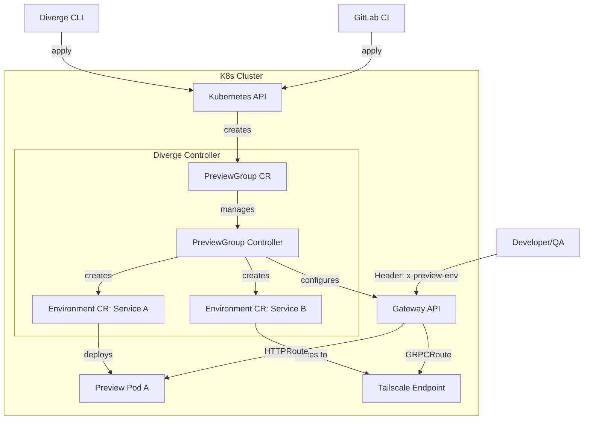

# PreviewGroup User Guide

Welcome to the PreviewGroup user guide. The Diverge project utilizes the `PreviewGroup` Custom Resource (CR) to orchestrate multi-service preview environments in Kubernetes. One CR to rule them all!

## 1. What is PreviewGroup?

A **PreviewGroup** allows you to deploy and manage a collection of related preview services together from a single Merge Request (MR) or Pull Request (PR). It acts as an "operator of operators," reading your group specification and automatically creating and managing child `Environment` CRs across multiple namespaces.

With PreviewGroup, you can confidently preview microservice changes alongside existing baseline services, run database migrations in isolated schemas, and route traffic seamlessly using Gateway API rules—all without deploying duplicate infrastructure.

## 2. Architecture Diagram



## 3. Quick Start

Create your first preview group using the Diverge CLI and a `.diverge.yaml` file.

1. **Create `.diverge.yaml`** at the root of your project:
   ```yaml
   source:
     type: gitlab
     mr: "42"
   routing:
     mode: header
     headerValue: "42"
   services:
     - name: payments-api
       image: myregistry/payments:test
       mode: image
   ```
2. **Deploy the group**:
   ```bash
   nix develop -c diverge preview create --from .diverge.yaml
   ```
3. **Check the status**:
   ```bash
   nix develop -c diverge preview status pg-mr-42
   ```

## 4. `.diverge.yaml` Configuration Reference

The `.diverge.yaml` file translates into a `PreviewGroupSpec`. Here are all the fields you can configure:

### `source` (Required)
Identifies the Source Control Management (SCM) context.
- `type`: `gitlab`, `github`, etc.
- `mr` / `pr`: The merge/pull request number.

### `routing` (Required)
Configures traffic routing shared by all services in the group.
- `mode`: The routing mode. Defaults to `header`.
- `headerKey`: The HTTP header key used for routing (defaults to `x-preview-env`).
- `headerValue` (Required): The value identifying this preview group (typically the MR number).
- `externalUrl`: An optional shareable URL for non-engineer access.

### `services` (Required)
A list of services included in this preview group.
- `name` (Required): Name of the K8s Service to preview.
- `mode`: The participation mode: `image`, `local`, or `baseline`. (Defaults to `image`).
- `image`: The container image to deploy (Required for `mode: image`).
- `endpoint`: The external endpoint (e.g., developer's Tailscale IP, required for `mode: local`).
- `namespace`: Target namespace for the preview deployment. If empty, falls back to the service's own namespace, then the controller's `--default-namespace` flag, then `"default"`.
- `port`: Container port. (Auto-discovered if empty).
- `parentRef`: Gateway API parentRef name. (Auto-discovered if empty).
- `pathPrefix`: Scopes HTTPRoute matching to a specific path prefix.
- `protocol`: Transport protocol, `http` (HTTPRoute) or `grpc` (GRPCRoute). Defaults to `http`.
- `imagePullPolicy`: Overrides image pull policy (`Always`, `Never`, `IfNotPresent`).
- `env`: Additional environment variables for the preview pod.
- `resources`: Overrides baseline resource requests/limits (CPU/Memory). Defaults to conservative values.
- `database`: Overrides group-level database config for this specific service.

### `database` (Optional)
Group-level database configuration (e.g., specifying a schema provider for isolation).

### `lifecycle` (Optional)
Configures automatic cleanup and TTL.
- `ttl`: Time-to-live for the group (e.g., `72h`).
- `cleanupOnMerge`: If `true`, the group is deleted when the source MR is merged/closed.

## 5. CLI Workflow

Manage your preview groups effectively using the `diverge preview` CLI commands. Remember to run commands in the nix dev shell:

- **Create a preview group:**
  ```bash
  nix develop -c diverge preview create --from .diverge.yaml
  ```
- **Check status:**
  ```bash
  nix develop -c diverge preview status <name>
  ```
- **Watch logs/status:**
  ```bash
  nix develop -c diverge preview watch <name>
  ```
- **Delete a group:**
  ```bash
  nix develop -c diverge preview delete <name>
  ```
- **Local Dev Intercept:**
  Spin up local development connecting directly to the cluster.
  ```bash
  nix develop -c diverge dev
  ```
- **Intercept and Release:**
  Route a specific service's traffic to your local machine (Tailscale endpoint) and release it back to normal.
  ```bash
  nix develop -c diverge preview intercept <service-name>
  nix develop -c diverge preview release <service-name>
  ```

## 6. Service Modes

The `mode` field on a service dictates how it runs in the preview group:

1. **`image` (default)**: Deploys the specified container image as a new preview pod in the cluster.
2. **`local`**: Routes traffic for the service to an external endpoint (e.g., your developer Tailscale IP) instead of deploying a pod. Perfect for hot-reload local dev while utilizing cloud baselines.
3. **`baseline`**: Includes the existing baseline service in the group routing without deploying a new version.

## 7. GitLab CI Component Setup

You can fully automate PreviewGroup deployments via GitLab CI. Reference the Diverge CI component located in `ci/gitlab/`.

Include the component in your `.gitlab-ci.yml`:

```yaml
include:
  - local: '/ci/gitlab/preview-group.yml'

deploy_preview:
  extends: .diverge-preview
  variables:
    DIVERGE_CONFIG: .diverge.yaml
```
*Note: The CLI is executed automatically within the CI jobs, ensuring it triggers during MR updates.*

## 8. MR Comment Bot

Diverge includes an automated MR Comment Bot that posts preview URLs directly into your merge requests.

When a PreviewGroup finishes deploying, the bot comments on the MR with:
- The `externalUrl` to access the preview.
- A summary of all services and their statuses.
- `lastLogSnippet`: The last few lines from a failed preview pod's container logs, allowing you to debug CrashLoopBackOff or OOMKilled issues straight from the MR comment!

## 9. Routing Modes

Traffic needs to know how to reach your preview services instead of the baseline.

- **Header Mode (Default):** Requires passing an HTTP header (e.g., `x-preview-env: 42`) in requests. This is the only Gateway API routing mode currently supported by the controller natively.
- **Query-Param Mode (via BFF middleware):** If frontend clients cannot easily append headers, use a Backend-For-Frontend (BFF) middleware that intercepts a **signed, scoped, expiring token** passed as a query parameter (e.g., `?preview_token=<signed-jwt>`). The BFF validates the token, extracts the preview environment identifier, injects `x-preview-env`, and strips the query parameter before forwarding. See [async-routing.md](architecture/async-routing.md#pattern-4-signed-query-param-middleware-the-v1-solution) for security requirements. **Do not** accept raw, unauthenticated preview identifiers from query parameters.

## 10. Database Integration

To prevent your preview environments from corrupting baseline data, PreviewGroup supports automated database isolation.

Set `--database-provider=schema` in your deployment or `database` spec in the YAML. Diverge will automatically create a clone or a fresh schema in PostgreSQL (e.g., `schema_mr_42`) and inject the credentials into your preview pods.

## 11. Migration Hooks

You can run automated database migrations before your preview services start taking traffic.

**Configuration:**
- **CLI Flags**: `--migration-image`, `--migration-args`, `--migration-blocking`
- **CRD Fields**: You can configure these in the `.spec.database.migrationJob` field of your `PreviewGroup` CR.

**Viewing Status:**
You can view the real-time status of your migration hooks (and any other lifecycle hooks) by running:
```bash
nix develop -c diverge preview status <name>
```
The output will include a **Hooks** section detailing the name, status, duration, and any error messages for each migration job.

## 12. Scale-to-Zero Integration

PreviewGroup natively integrates with KEDA to automatically scale idle preview services down to zero replicas:

- **HTTP services:** Via KEDA HTTP Add-on (`HTTPScaledObject`). The Diverge Activator Proxy intercepts the first request and wakes the service seamlessly.
- **Temporal workers:** Via native KEDA `temporal` trigger. Scales based on task queue backlog.
- **Kafka consumers:** Via native KEDA `kafka` trigger. Scales based on consumer group lag.

Configure per-service autoscaling in the `keda` block of each service spec. See the [Autoscaling and Scale-to-Zero guide](guides/autoscaling-and-scale-to-zero.md) for details.

## 13. Troubleshooting

**1. Service is stuck in `Pending` or `Degraded`:**
Run `nix develop -c diverge preview status <name>` and look at the `reason` and `message` fields. If the reason is `ImagePullBackOff`, ensure your image name and registry credentials are correct.

**2. Baseline service is receiving my preview traffic:**
Ensure you are passing the correct routing header (e.g., `x-preview-env: 42`). If using a path prefix, confirm your HTTP request matches the `pathPrefix` defined in your `.diverge.yaml`.

**3. Gateway API HTTPRoute/GRPCRoute not created:**
Check if your `Protocol` is set correctly (`http` vs `grpc`). `grpc` generates a GRPCRoute. If `parentRef` is missing and auto-discovery failed, explicitly set `parentRef` to your gateway proxy name.

**4. OOMKilled or resource limits:**
If your preview pod crashes with OOMKilled, the default conservative limits (100m CPU, 256Mi RAM) might be too low. Override them using the `resources` block in the service spec.
