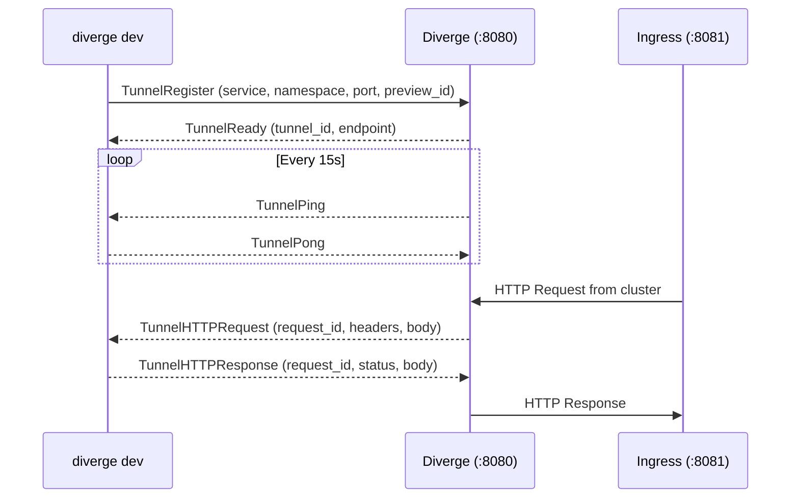

# ConnectRPC API Reference

The Diverge API server is a stateless facade over Kubernetes Custom Resource Definitions (CRDs). It exposes Diverge resources (`Environment`, `PreviewGroup`) and operational workflows via [ConnectRPC](https://connectrpc.com/), supporting HTTP/1.1 JSON, HTTP/2, gRPC, and gRPC-Web.

## Transport & Protocols

The server listens on `:8080` (RPC) and `:8081` (Tunnel Proxy):

| Protocol | Content-Type | Transport | Description |
| :--- | :--- | :--- | :--- |
| **Connect (JSON)** | `application/json` | HTTP/1.1, HTTP/2 | Standard JSON over POST; used by `curl`, CLI, and web UIs. |
| **Connect (Protobuf)** | `application/proto` | HTTP/1.1, HTTP/2 | High-performance binary protobuf over Connect protocol. |
| **gRPC** | `application/grpc` | HTTP/2 | Native gRPC protocol over HTTP/2 framing. |
| **gRPC-Web** | `application/grpc-web` | HTTP/1.1, HTTP/2 | Browser-friendly gRPC transport. |

**Endpoint URL Format:** `POST https://<host>/diverge.v1alpha1.<ServiceName>/<RPCMethodName>`

---

## Security & RBAC

- **Authentication:** Pass a Kubernetes OIDC JWT or ServiceAccount token in `Authorization: Bearer <token>`. Validated via Kubernetes `TokenReview` and cached via in-memory LRU.
- **Authorization:** Evaluated per request via Kubernetes `SubjectAccessReview` (SAR) against the `diverge.dev` API group.
  - *Namespace-scoped:* Verifies `get`, `list`, `watch`, `create`, `update`, `delete` on `environments` or `previewgroups` in the target namespace.
  - *Cluster-scoped:* Verifies permissions at empty namespace `""` (e.g., `GetClusterInfo`, cluster-wide `WatchEnvironments`).
  - *Pod Logs:* `StreamLogs` requires `get` on `environments.diverge.dev` **and** `get` on `pods/log` (core API group).
- **Validation:** Names and namespaces must conform to DNS-1123 (`^[a-z0-9]([a-z0-9\-]{0,61}[a-z0-9])?$`, max 63 chars). Request namespaces must match payload namespaces.
- **Audit Logging:** All authentication events, authorization rejections, and mutations are recorded as structured JSON audit logs.

---

## Core API Patterns

### Cursor-Based Pagination
List RPCs (`ListEnvironments`, `ListPreviewGroups`) use cursor pagination backed by Kubernetes `continue` tokens:
- `page_size` (`int32`): Maximum items per page (`1`–`1000`, default `100`).
- `page_token` (`string`): Opaque cursor token from `next_page_token` (max 4096 chars).
- `label_selector` (`string`): Kubernetes label selector expression (max 1024 chars).
> [!IMPORTANT]
> A `page_token` is tied to the original query's `label_selector` and `resource_version`. Modifying query parameters between pages or using an expired token returns `CodeAborted`.

### Optimistic Concurrency
Mutations (`UpdateEnvironment`, `UpdatePreviewGroup`) enforce optimistic concurrency via `resource_version`:
1. Retrieve the current resource with `Get*`.
2. Send the update request including `resource_version`.
3. If modified concurrently by another client, the server returns `CodeAborted`. Re-fetch and retry.

### Partial Updates (Field Masks)
`UpdateEnvironment` and `UpdatePreviewGroup` accept `update_mask` (`google.protobuf.FieldMask`):
- **Allowed top-level paths:** `"spec"`, `"labels"`, `"annotations"`.
- Nested paths (e.g. `"spec.routing"`) are rejected with `CodeInvalidArgument`. Omitting `update_mask` updates all fields.

### Streaming Patterns
- **Resource Watches (`WatchEnvironments`, `WatchPreviewGroups`):** Server-streaming Informer feed. Sends initial state as `WATCH_EVENT_TYPE_ADDED`, followed by real-time `ADDED`, `MODIFIED`, `DELETED` deltas with version deduplication.
- **Log Streaming (`StreamLogs`):** Server-streaming pod logs. Multiplexes up to **5 concurrent pods** (`CodeFailedPrecondition` if exceeded). Supports `follow`, `tail_lines`, `timestamps`, and `since_time`.
- **Dev Tunnel (`TunnelService.Tunnel`):** Bidirectional streaming between CLI (`diverge dev`) and cluster. Heartbeats ping/pong every 15s (45s timeout). Payloads >32 KB use chunk streaming (`TunnelRequestChunk` / `TunnelResponseChunk`).

---

## Error Codes

Internal Kubernetes errors are sanitized into standard ConnectRPC codes:

| ConnectRPC Code | HTTP Status | Trigger Condition |
| :--- | :--- | :--- |
| `CodeInvalidArgument` | `400` | Malformed DNS-1123 label, invalid label selector, unsupported field mask path. |
| `CodeUnauthenticated` | `401` | Missing, invalid, or expired Bearer token in `Authorization` header. |
| `CodePermissionDenied` | `403` | Kubernetes RBAC SAR check failed, or unauthorized preview ownership. |
| `CodeNotFound` | `404` | Target environment, preview group, or pod not found. |
| `CodeAlreadyExists` | `409` | Resource already exists in namespace during creation. |
| `CodeAborted` | `409` | Optimistic concurrency conflict (`resource_version` mismatch) or expired page token. |
| `CodeFailedPrecondition` | `400` | StreamLogs target exceeds limit of 5 pods. |
| `CodeResourceExhausted` | `429` | Server-wide stream concurrency limit reached, or watch buffer overflow. |
| `CodeDeadlineExceeded` | `504` | Kubernetes API or tunnel response deadline exceeded. |
| `CodeUnavailable` | `503` | Server is shutting down or Kubernetes API is unreachable. |
| `CodeUnimplemented` | `501` | Unimplemented RPC (e.g., `ExtendTTL`) or unconfigured feature. |
| `CodeCanceled` | `499` | Client canceled request context. |
| `CodeInternal` | `500` | Unexpected server error (sanitized from client). |

---

## 1. EnvironmentService (`diverge.v1alpha1.EnvironmentService`)

Manages single-service preview environments.

### `CreateEnvironment`
Creates a preview environment. **RBAC:** `create` on `environments.diverge.dev`.

| Parameter | Type | Required | Description |
| :--- | :--- | :--- | :--- |
| **Req:** `namespace` | `string` | No | Target namespace (default: `"default"`). |
| **Req:** `environment` | `Environment` | **Yes** | Environment resource definition. |
| **Resp:** `environment` | `Environment` | — | Created environment with server metadata. |

```bash
curl -X POST https://diverge.example.com/diverge.v1alpha1.EnvironmentService/CreateEnvironment \
  -H "Content-Type: application/json" -H "Authorization: Bearer $TOKEN" \
  -d '{"namespace": "default", "environment": {"name": "pr-42", "spec": {"source": {"provider": "github", "project": "org/repo", "mr": 42, "branch": "feat-x"}, "routing": {"mode": "path", "header_key": "x-diverge-env", "header_value": "pr-42"}, "lifecycle": {"ttl": "7200s", "cleanup_on_merge": true}}}}'
```

### `GetEnvironment`
Retrieves an environment. **RBAC:** `get` on `environments.diverge.dev`.

| Parameter | Type | Required | Description |
| :--- | :--- | :--- | :--- |
| **Req:** `namespace` | `string` | **Yes** | Target namespace. |
| **Req:** `name` | `string` | **Yes** | Name of the environment. |
| **Resp:** `environment` | `Environment` | — | The retrieved environment. |

```bash
curl -X POST https://diverge.example.com/diverge.v1alpha1.EnvironmentService/GetEnvironment \
  -H "Content-Type: application/json" -H "Authorization: Bearer $TOKEN" \
  -d '{"namespace": "default", "name": "pr-42"}'
```

### `ListEnvironments`
Lists environments with filtering and pagination. **RBAC:** `list` on `environments.diverge.dev`.

| Parameter | Type | Required | Description |
| :--- | :--- | :--- | :--- |
| **Req:** `namespace` | `string` | No | Namespace scope (empty for cluster-wide). |
| **Req:** `page_size` | `int32` | No | Items per page (`1`–`1000`, default `100`). |
| **Req:** `page_token` | `string` | No | Pagination cursor token. |
| **Req:** `label_selector` | `string` | No | K8s label selector (e.g. `app=web`). |
| **Req:** `phase` / `branch` | `string` | No | Filter by status phase or branch name. |
| **Resp:** `environments` | `repeated Environment` | — | Environment objects for current page. |
| **Resp:** `next_page_token` | `string` | — | Cursor for next page (empty if last page). |
| **Resp:** `total_size` | `int32` | — | Total count if available. |

```bash
curl -X POST https://diverge.example.com/diverge.v1alpha1.EnvironmentService/ListEnvironments \
  -H "Content-Type: application/json" -H "Authorization: Bearer $TOKEN" \
  -d '{"namespace": "default", "page_size": 10, "label_selector": "app=web"}'
```

### `UpdateEnvironment`
Updates an environment with concurrency control. **RBAC:** `update` on `environments.diverge.dev`.

| Parameter | Type | Required | Description |
| :--- | :--- | :--- | :--- |
| **Req:** `environment` | `Environment` | **Yes** | Must include `name`, `namespace`, and current `resource_version`. |
| **Req:** `update_mask` | `FieldMask` | No | Comma-separated top-level paths: `"spec"`, `"labels"`, `"annotations"`. |
| **Resp:** `environment` | `Environment` | — | Updated environment object. |

```bash
curl -X POST https://diverge.example.com/diverge.v1alpha1.EnvironmentService/UpdateEnvironment \
  -H "Content-Type: application/json" -H "Authorization: Bearer $TOKEN" \
  -d '{"environment": {"name": "pr-42", "namespace": "default", "resource_version": "1049281", "labels": {"env": "preview"}}, "update_mask": "labels"}'
```

### `DeleteEnvironment`
Deletes an environment. **RBAC:** `delete` on `environments.diverge.dev`.

| Parameter | Type | Required | Description |
| :--- | :--- | :--- | :--- |
| **Req:** `namespace` | `string` | **Yes** | Target namespace. |
| **Req:** `name` | `string` | **Yes** | Target environment name. |
| **Req:** `force` | `bool` | No | Bypass finalizers when `true`. |
| **Resp:** `{}` | — | — | Empty response on success. |

```bash
curl -X POST https://diverge.example.com/diverge.v1alpha1.EnvironmentService/DeleteEnvironment \
  -H "Content-Type: application/json" -H "Authorization: Bearer $TOKEN" \
  -d '{"namespace": "default", "name": "pr-42"}'
```

### `ExtendTTL`
Extends environment lifecycle duration. *(Returns `CodeUnimplemented`)*.

| Parameter | Type | Required | Description |
| :--- | :--- | :--- | :--- |
| **Req:** `namespace` / `name` | `string` | **Yes** | Target environment identifier. |
| **Req:** `extend_by` | `Duration` | **Yes** | Duration string (e.g. `"3600s"`). |
| **Resp:** `environment` | `Environment` | — | Environment with updated expiry status. |

### `WatchEnvironments`
Server-streaming event feed. **RBAC:** `watch` on `environments.diverge.dev`.

| Parameter | Type | Required | Description |
| :--- | :--- | :--- | :--- |
| **Req:** `namespace` | `string` | No | Scope watch (empty for cluster-wide). |
| **Req:** `label_selector` | `string` | No | Label selector filter. |
| **Req:** `resource_version` | `string` | No | Baseline resource version. |
| **Resp:** `type` | `WatchEventType` | — | `ADDED` (1), `MODIFIED` (2), `DELETED` (3). |
| **Resp:** `environment` | `Environment` | — | Resource payload. |
| **Resp:** `resource_version` | `string` | — | Resource version of the event. |

```bash
curl -N -X POST https://diverge.example.com/diverge.v1alpha1.EnvironmentService/WatchEnvironments \
  -H "Content-Type: application/json" -H "Authorization: Bearer $TOKEN" \
  -d '{"namespace": "default"}'
```

### `StreamLogs`
Server-streaming container logs. **RBAC:** `get` on `environments` AND `pods/log`.

| Parameter | Type | Required | Description |
| :--- | :--- | :--- | :--- |
| **Req:** `namespace` / `environment_name` | `string` | **Yes** | Target environment. |
| **Req:** `service_name` | `string` | No | Matches pod label `app.kubernetes.io/name`. |
| **Req:** `container` | `string` | No | Specific container name. |
| **Req:** `follow` / `timestamps` / `previous` | `bool` | No | Follow stream, include timestamps, or read previous pod. |
| **Req:** `tail_lines` | `int64` | No | Prior lines to stream (max 5 pods multiplexed). |
| **Req:** `since_time` | `Timestamp` | No | RFC 3339 timestamp cutoff. |
| **Resp:** `pod_name` / `container_name` | `string` | — | Pod and container identifiers. |
| **Resp:** `content` / `timestamp` | `string` / `Timestamp` | — | Log line content and timestamp. |

```bash
curl -N -X POST https://diverge.example.com/diverge.v1alpha1.EnvironmentService/StreamLogs \
  -H "Content-Type: application/json" -H "Authorization: Bearer $TOKEN" \
  -d '{"namespace": "default", "environment_name": "pr-42", "follow": true, "tail_lines": 50, "timestamps": true}'
```

---

## 2. PreviewGroupService (`diverge.v1alpha1.PreviewGroupService`)

Manages multi-service composite preview groups.

### `CreatePreviewGroup`
Creates a PreviewGroup. **RBAC:** `create` on `previewgroups.diverge.dev`.

| Parameter | Type | Required | Description |
| :--- | :--- | :--- | :--- |
| **Req:** `namespace` | `string` | No | Target namespace (default: `"default"`). |
| **Req:** `preview_group` | `PreviewGroup` | **Yes** | PreviewGroup definition. |
| **Resp:** `preview_group` | `PreviewGroup` | — | Created PreviewGroup object. |

```bash
curl -X POST https://diverge.example.com/diverge.v1alpha1.PreviewGroupService/CreatePreviewGroup \
  -H "Content-Type: application/json" -H "Authorization: Bearer $TOKEN" \
  -d '{"namespace": "default", "preview_group": {"name": "group-auth", "spec": {"owner": "alice", "routing": {"mode": "header", "header_key": "x-diverge-group", "header_value": "group-auth"}, "services": [{"name": "auth-svc", "image": "corp/auth:v1", "port": 8080}], "lifecycle": {"ttl": "14400s", "cleanup_on_merge": true}}}}'
```

### `GetPreviewGroup`
Retrieves a PreviewGroup. **RBAC:** `get` on `previewgroups.diverge.dev`.

| Parameter | Type | Required | Description |
| :--- | :--- | :--- | :--- |
| **Req:** `namespace` / `name` | `string` | **Yes** | Target PreviewGroup identifier. |
| **Resp:** `preview_group` | `PreviewGroup` | — | Retrieved PreviewGroup resource. |

### `ListPreviewGroups`
Lists PreviewGroups with pagination. **RBAC:** `list` on `previewgroups.diverge.dev`.

| Parameter | Type | Required | Description |
| :--- | :--- | :--- | :--- |
| **Req:** `namespace` | `string` | No | Scope (empty for cluster-wide). |
| **Req:** `page_size` / `page_token` | `int32` / `string` | No | Page size (`1`–`1000`) and cursor token. |
| **Req:** `label_selector` | `string` | No | K8s label selector query. |
| **Resp:** `preview_groups` | `repeated PreviewGroup` | — | Items for current page. |
| **Resp:** `next_page_token` / `total_size` | `string` / `int32` | — | Next cursor and total item count. |

### `UpdatePreviewGroup`
Updates a PreviewGroup with concurrency control. **RBAC:** `update` on `previewgroups.diverge.dev`.

| Parameter | Type | Required | Description |
| :--- | :--- | :--- | :--- |
| **Req:** `preview_group` | `PreviewGroup` | **Yes** | Must include `resource_version`. |
| **Req:** `update_mask` | `FieldMask` | No | Allowed paths: `"spec"`, `"labels"`, `"annotations"`. |
| **Resp:** `preview_group` | `PreviewGroup` | — | Updated PreviewGroup object. |

### `DeletePreviewGroup`
Deletes a PreviewGroup. **RBAC:** `delete` on `previewgroups.diverge.dev`.

| Parameter | Type | Required | Description |
| :--- | :--- | :--- | :--- |
| **Req:** `namespace` / `name` | `string` | **Yes** | Target PreviewGroup identifier. |
| **Resp:** `{}` | — | — | Empty response on success. |

### `WatchPreviewGroups`
Server-streaming event feed. **RBAC:** `watch` on `previewgroups.diverge.dev`.

| Parameter | Type | Required | Description |
| :--- | :--- | :--- | :--- |
| **Req:** `namespace` / `label_selector` | `string` | No | Scope and label selector. |
| **Resp:** `type` / `resource_version` | `WatchEventType` / `string` | — | Event type and resource version. |
| **Resp:** `preview_group` | `PreviewGroup` | — | PreviewGroup resource payload. |

---

## 3. ClusterService (`diverge.v1alpha1.ClusterService`)

Provides operational controller telemetry.

### `GetClusterInfo`
Returns controller health and resource counts. **RBAC:** `list` on `environments` & `previewgroups` at cluster scope.

| Parameter | Type | Description |
| :--- | :--- | :--- |
| **Req:** `{}` | — | Empty request body. |
| **Resp:** `environment_count` / `preview_group_count` | `int32` | Total resource counts across cluster. |
| **Resp:** `controller_version` / `controller_healthy` | `string` / `bool` | Controller build version and health status. |
| **Resp:** `namespaces` | `repeated string` | Active managed namespaces. |

```bash
curl -X POST https://diverge.example.com/diverge.v1alpha1.ClusterService/GetClusterInfo \
  -H "Content-Type: application/json" -H "Authorization: Bearer $TOKEN" -d '{}'
```

---

## 4. AuthService (`diverge.v1alpha1.AuthService`)

Exposes user identity and effective cluster permissions.

### `GetCurrentUser`
Returns caller identity derived from `TokenReview`. **RBAC:** None (requires valid token).

| Parameter | Type | Description |
| :--- | :--- | :--- |
| **Req:** `{}` | — | Empty request body. |
| **Resp:** `user_id` / `email` | `string` | Username and email (if OIDC-provided). |
| **Resp:** `groups` | `repeated string` | Kubernetes group memberships. |
| **Resp:** `issuer` | `string` | Token issuer (defaults to `"kubernetes"`). |

```bash
curl -X POST https://diverge.example.com/diverge.v1alpha1.AuthService/GetCurrentUser \
  -H "Content-Type: application/json" -H "Authorization: Bearer $TOKEN" -d '{}'
```

### `ListPermissions`
Scans caller RBAC verbs for Diverge resources in a namespace. **RBAC:** None (self-SAR).

| Parameter | Type | Required | Description |
| :--- | :--- | :--- | :--- |
| **Req:** `namespace` | `string` | No | Target namespace (default: `"default"`). |
| **Resp:** `permissions` | `repeated Permission` | — | Matrix of allowed resources (`environments`, `previewgroups`) and verbs (`get`, `list`, `watch`, `create`, `update`, `delete`). |

```bash
curl -X POST https://diverge.example.com/diverge.v1alpha1.AuthService/ListPermissions \
  -H "Content-Type: application/json" -H "Authorization: Bearer $TOKEN" \
  -d '{"namespace": "default"}'
```

---

## 5. TunnelService (`diverge.v1alpha1.TunnelService`)

Provides bidirectional reverse tunneling for local developer traffic (`diverge dev`).

### `Tunnel`
Establishes a multiplexed stream between local CLI and cluster. **RBAC:** `create` on `environments` in target namespace. **Ownership:** Caller must match `PreviewGroup.spec.owner`.



#### Message Envelopes

| Stream Direction | Payload Oneof Field | Type | Description |
| :--- | :--- | :--- | :--- |
| **Client → Server** | `register` | `TunnelRegister` | Initial registration (`service`, `namespace`, `port`, `preview_id`). |
| | `http_response` | `TunnelHTTPResponse` | HTTP response from local process (`status_code`, `headers`, `body`). |
| | `response_chunk` | `TunnelResponseChunk` | Body continuation chunk for payloads >32 KB. |
| | `pong` / `close` | `TunnelPong` / `TunnelClose` | Heartbeat reply or graceful disconnect notice. |
| **Server → Client** | `ready` | `TunnelReady` | Tunnel activation acknowledgement (`tunnel_id`, `endpoint`). |
| | `http_request` | `TunnelHTTPRequest` | Inbound HTTP request to forward (`method`, `path`, `headers`, `body`). |
| | `request_chunk` | `TunnelRequestChunk` | Request continuation chunk for payloads >32 KB. |
| | `ping` / `close` | `TunnelPing` / `TunnelClose` | Heartbeat probe or server-side eviction signal. |

---

## Data Schema Reference

### `Environment`
```protobuf
message Environment {
  string name = 1;
  string namespace = 2;
  EnvironmentSpec spec = 3;
  EnvironmentStatus status = 4;
  google.protobuf.Timestamp created_at = 5;
  map<string, string> labels = 6;
  map<string, string> annotations = 7;
  string resource_version = 8;
}
```

| Field | Type | Description |
| :--- | :--- | :--- |
| `spec.source` | `EnvironmentSource` | VCS origin (`provider`, `project`, `mr`, `branch`, `commit_sha`). |
| `spec.deploy` | `EnvironmentDeploy` | Strategy (`mode`, `namespace`, `changed_services`, `baseline_ref`, `manifests`). |
| `spec.routing` | `EnvironmentRouting` | Ingress rules (`mode`, `header_key`, `header_value`, `external_url`, `cookie`). |
| `spec.database` | `EnvironmentDatabase` | Database config (`mode`, `connection_ref`, `seed_source`, `migration_job`). |
| `spec.lifecycle` | `EnvironmentLifecycle` | Constraints (`ttl` [Duration], `cleanup_on_merge` [bool]). |
| `spec.testing` | `TestingSpec` | Test automation triggers (`enabled`, `trigger`, `timeout`, `required`). |
| `status.phase` | `string` | Phase (`Pending`, `Deploying`, `Ready`, `Failed`, `Terminating`). |
| `status.url` | `string` | Generated preview routing URL. |
| `status.conditions` | `repeated Condition` | K8s condition status array (`type`, `status`, `reason`, `message`). |

### `PreviewGroup`
```protobuf
message PreviewGroup {
  string name = 1;
  string namespace = 2;
  PreviewGroupSpec spec = 3;
  PreviewGroupStatus status = 4;
  google.protobuf.Timestamp created_at = 5;
  map<string, string> labels = 6;
  map<string, string> annotations = 7;
  string resource_version = 8;
}
```

| Field | Type | Description |
| :--- | :--- | :--- |
| `spec.owner` | `string` | Owner username required for dev tunnel access. |
| `spec.services` | `repeated PreviewGroupServiceSpec` | Array of services (`name`, `image`, `port`, `endpoint`, `env`, `resources`). |
| `spec.routing` | `PreviewGroupRouting` | Routing rules (`mode`, `header_key`, `header_value`, `base_domain`). |
| `spec.lifecycle` | `PreviewGroupLifecycle` | Constraints (`ttl` [Duration], `cleanup_on_merge` [bool]). |
| `status.phase` | `string` | Aggregate group phase status. |
| `status.services` | `repeated PreviewGroupServiceStatus` | Per-service deployment phase, url, reason, and last log snippet. |
