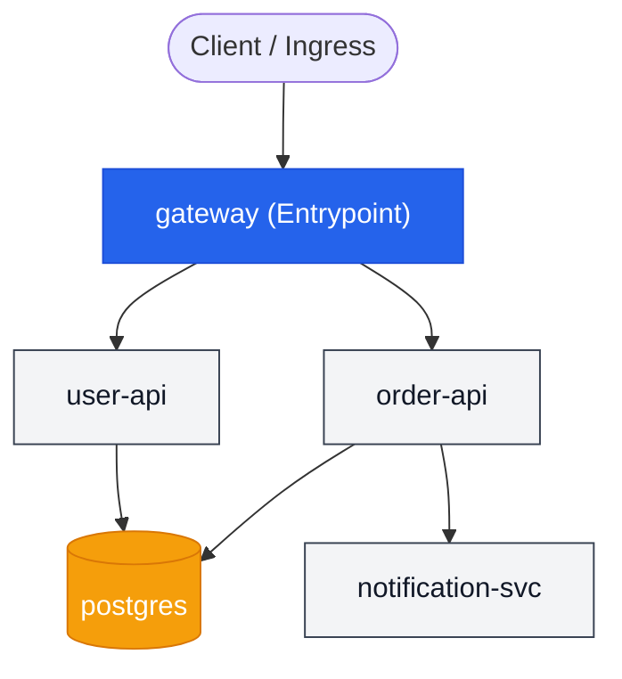

# Microservices Architecture Example

This example demonstrates how to configure and manage a multi-service architecture with **Diverge v0.8.0**. It showcases static topology modeling, git-based delta change detection, request route simulation, and lightweight preview environments.

---

## Overview

In modern microservice architectures, creating a full replica of every service and database for each pull request is expensive, slow, and resource-heavy. Diverge allows you to deploy only the services that have actually changed (**delta deployments**) while seamlessly routing traffic to baseline instances for unchanged dependencies via header-based routing.

### Services in this Example



- **`gateway`**: The public entrypoint service. Receives external HTTP traffic and routes downstream to `user-api` and `order-api`.
- **`user-api`**: Handles user authentication and profile data, backed by PostgreSQL.
- **`order-api`**: Processes customer orders, communicates with PostgreSQL, and notifies `notification-svc`.
- **`notification-svc`**: Dispatches email and push notifications.
- **`postgres`**: Relational database storage shared across APIs.

---

## Configuration (`.diverge.yaml`)

The [`.diverge.yaml`](.diverge.yaml) configuration file defines service paths, dependencies, entrypoints, and deployment strategies:

```yaml
version: "1"
services:
  gateway:
    image:
      repository: gateway
      tag_template: "{{ .SHA }}"
    entrypoint: true
    paths:
      - services/gateway
    dependsOn:
      - user-api
      - order-api
  user-api:
    image:
      repository: user-api
      tag_template: "{{ .SHA }}"
    paths:
      - services/user-api
    dependsOn:
      - postgres
  order-api:
    image:
      repository: order-api
      tag_template: "{{ .SHA }}"
    paths:
      - services/order-api
    dependsOn:
      - postgres
      - notification-svc
  notification-svc:
    image:
      repository: notification-svc
      tag_template: "{{ .SHA }}"
    paths:
      - services/notification-svc
  postgres:
    image:
      repository: postgres
      tag_template: "16"
    paths:
      - migrations

defaults:
  routing:
    mode: header
    domain: preview.example.com
  deploy:
    mode: delta
```

### Key Configuration Elements

1. **`entrypoint: true`**: Identifies `gateway` as an ingress entrypoint. Diverge uses this to trace ingress paths and configure HTTP routing rules.
2. **`paths`**: File glob patterns for change detection. When files in `services/order-api` change, Diverge identifies `order-api` as affected.
3. **`dependsOn`**: Declares upstream/downstream call graph relationships for route simulation and dependency mapping.
4. **`deploy.mode: delta`**: Enables delta deployments. Only changed services are built and deployed into the preview environment; unchanged services fall back to shared baseline services in the cluster.
5. **`routing.mode: header`**: Uses context headers (e.g. `x-diverge-env`) propagated across service hops to direct traffic to preview instances.

---

## CLI Features & Usage

### 1. Validate Topology & Dependencies

Check your service graph for cycles, self-dependencies, or missing service references:

```bash
diverge graph validate
```

*Output:*
```text
✓ No cycles detected
✓ All service references valid
✓ 1 entrypoint found: gateway
```

### 2. Detect Changed Services (`diff`)

Compare your current branch against a base branch (e.g., `main`) to see which services are modified and which upstream callers are impacted:

```bash
# See what changed
diverge diff --base main
```

*Example Output:*
```text
Changed services (compared to main):
  • order-api

1 service(s) affected

Upstream services that may be affected:
  ↑ gateway

Ingress paths:
  gateway → order-api
```

You can also output structured JSON for CI/CD scripting:

```bash
diverge diff --base main --output json
```

### 3. Trace Request Routing (`route`)

Simulate how incoming traffic reaches a specific service from cluster entrypoints and verify intermediate hops:

```bash
# Trace how requests reach order-api
diverge route order-api
```

*Example Output:*
```text
Request routing for "order-api":

  1. Client request with header: x-diverge-env: <env-name>
  2. → gateway (entrypoint)
     Route: HTTPRoute matching header
  3. → order-api ✓

  Path: gateway → order-api (1 hops)
  Header: x-diverge-env propagated at each hop ✓

  ⚠ Ensure intermediate services propagate the routing header.
    See: https://docs.diverge.dev/guides/header-propagation
```

### 4. Visualize Service Topology (`graph show`)

Render the full topology graph in ASCII tree format, or export as Mermaid, DOT, or JSON:

```bash
# Visualize the full topology as a Mermaid diagram
diverge graph show --output mermaid
```

Or view as an ASCII tree:

```bash
diverge graph show
```

*Example Output:*
```text
Service Graph (source: static)
  ● gateway (entrypoint)
    ├── → user-api
    │   └── → postgres
    └── → order-api
        ├── → postgres
        └── → notification-svc
```

### 5. Spin Up a Delta Preview Environment (`create`)

Create an isolated preview environment on your Kubernetes cluster. In delta mode, Diverge automatically detects changed services and only deploys those containers:

```bash
# Create a preview environment (delta mode auto-detects changes)
diverge create --name my-feature
```

*Output:*
```text
✓ Ingress path: gateway → order-api (1 hops)
ℹ Downstream services handled by mesh routing
✅ Environment requested. Run 'diverge status my-feature' to monitor deployment progress.
🌐 URL: https://my-feature.preview.example.com
```

---

## Testing the Preview Environment

Once created, test your preview environment by sending traffic with the preview domain or header:

```bash
# Via subdomain (automatically mapped by Diverge ingress)
curl https://my-feature.preview.example.com/orders

# Or via custom header to the shared gateway
curl -H "x-diverge-env: my-feature" https://preview.example.com/orders
```

When you are done testing, clean up the environment:

```bash
diverge delete my-feature
```
